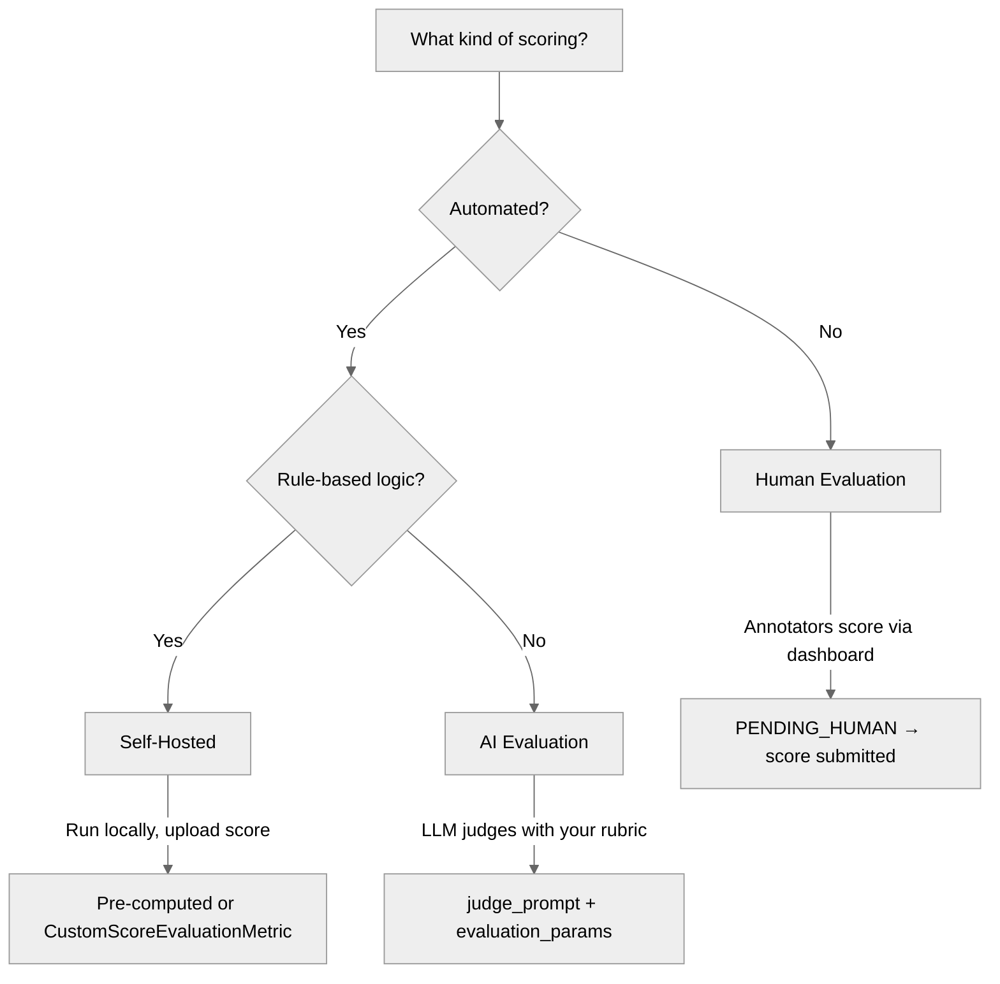

import ConceptsOverviewCard from '/snippets/cards/concepts-overview-card.mdx';
import EvaluationCard from '/snippets/cards/evaluation-card.mdx';
import SDKMetricsServiceCard from '/snippets/cards/sdk-metrics-service-card.mdx';

## What are Metrics?

Metrics define how Galtea scores your [product's](/concepts/product) outputs during [evaluations](/concepts/product/version/session/evaluation). Each metric captures one specific quality dimension — factual accuracy, tone, security resilience, or a custom criterion you define.

<Info>
  Metrics are organization-wide and can be reused across multiple products. You can link metrics to [Specifications](/concepts/product/specification) for structured evaluation workflows.
</Info>

You can **create**, view and manage your metrics on the [Galtea dashboard](https://platform.galtea.ai/) or programmatically using the [Galtea SDK](/sdk/api/metric/service).

{/* <!-- VIDEO PLACEHOLDER: Custom metric creation walkthrough (60s)
<video
  autoPlay muted loop playsInline
  className="w-full aspect-video rounded-xl"
  src="/videos/custom-metric-creation.mp4"
></video>
--> */}

## Two Families of Metrics

- **Deterministic metrics** apply rule-based logic — string matching, numerical checks, bounding box overlap. Results are consistent and reproducible. Built-in examples: [BLEU](/concepts/metric/bleu), [ROUGE](/concepts/metric/rouge), [Text Similarity](/concepts/metric/text-similarity), [Tool Correctness](/concepts/metric/tool-correctness). You can also define your own using the SDK's `CustomScoreEvaluationMetric` class — see [our tutorial](/sdk/tutorials/evaluate-with-custom-metrics).

- **Non-deterministic metrics** use an LLM-as-a-judge to assess open-ended qualities like factual accuracy, misuse resilience, and task completion. Galtea's judges are human-aligned and optimized for each evaluation type. You can also [create your own AI Evaluation metrics](/concepts/metric/evaluation-types#ai-evaluation) with a custom scoring rubric.

## How Metrics Are Evaluated

Every metric has an [Evaluation Type](/concepts/metric/evaluation-types) that determines how scoring happens:

 

<CardGroup cols={3}>
  <Card title="Self-Hosted" icon="server" href="/concepts/metric/evaluation-types#self-hosted">
    Your own logic runs locally; only the score is uploaded.
  </Card>
  <Card title="AI Evaluation" icon="robot" href="/concepts/metric/evaluation-types#ai-evaluation">
    An LLM scores responses using a rubric you define.
  </Card>
  <Card title="Human Evaluation" icon="user" href="/concepts/metric/evaluation-types#human-evaluation">
    Human annotators score responses using defined criteria.
  </Card>
</CardGroup>

## Available Metrics

<Note>
  The following table lists the default metrics available in the Galtea platform. You can also [create custom metrics](/concepts/metric/evaluation-types#ai-evaluation) or [generate metrics from specifications](/concepts/metric/ai-generation).
</Note>

| Metric | Category | Description |
| --- | --- | --- |
| **[Factual Accuracy](/concepts/metric/factual-accuracy)** | RAG | Evaluates whether the actual_output factually aligns with the expected_output. |
| **[Resilience To Noise](/concepts/metric/resilience-to-noise)** | RAG | Evaluates whether the output is resilient to noisy input (typos, OCR/ASR errors). |
| **[Answer Relevancy](/concepts/metric/answer-relevancy)** | RAG | Evaluates how relevant the actual_output is compared to the provided input. |
| **[Faithfulness](/concepts/metric/faithfulness)** | RAG | Evaluates whether the actual_output factually aligns with the retrieval_context. |
| **[Contextual Precision](/concepts/metric/contextual-precision)** | RAG | Evaluates whether relevant retrieval_context nodes are ranked higher than irrelevant ones. |
| **[Contextual Recall](/concepts/metric/contextual-recall)** | RAG | Evaluates whether the retrieval_context sufficiently covers the expected_output. |
| **[Contextual Relevancy](/concepts/metric/contextual-relevancy)** | RAG | Evaluates the overall relevance of the retrieval_context for a given input. |
| **[BLEU](/concepts/metric/bleu)** | Deterministic | Measures n-gram overlap between actual and expected output. |
| **[ROUGE](/concepts/metric/rouge)** | Deterministic | Measures longest common subsequence between actual and expected output. |
| **[METEOR](/concepts/metric/meteor)** | Deterministic | Aligns words using exact matches, stems, or synonyms. |
| **[Text Similarity](/concepts/metric/text-similarity)** | Deterministic | Quantifies textual resemblance using character-level fuzzy matching. |
| **[Text Match](/concepts/metric/text-match)** *(deprecated)* | Deterministic | Binary match using character-level fuzzy matching with a threshold. Use [Text Similarity](/concepts/metric/text-similarity) instead. |
| **[IOU](/concepts/metric/iou)** | Deterministic | Measures spatial overlap between predicted and reference bounding boxes. |
| **[Spatial Match](/concepts/metric/spatial-match)** | Deterministic | Binary evaluation of spatial alignment using IoU score. |
| **[URL Validation](/concepts/metric/url-validation)** | Deterministic | Checks if all URLs in the response are valid and safe. |
| **[Tool Correctness](/concepts/metric/tool-correctness)** | Deterministic | Compares tools used by the agent against expected tools. |
| **[JSON Field Match](/concepts/metric/json-field-match)** | Deterministic | Compares JSON objects field by field, returning the fraction of expected fields that match. |
| **[JSON Field Match (Normalized)](/concepts/metric/json-field-match-normalized)** | Deterministic | Compares JSON objects field by field with case-insensitive and accent-insensitive string matching. |
| **[Role Adherence](/concepts/metric/role-adherence)** | Conversational | Evaluates whether the chatbot adheres to its given role throughout a conversation. |
| **[Conversation Completeness](/concepts/metric/conversation-completeness)** | Conversational | Evaluates whether the chatbot satisfies user needs throughout a conversation. |
| **[Conversation Relevancy](/concepts/metric/conversation-relevancy)** | Conversational | Evaluates whether the chatbot generates relevant responses throughout a conversation. |
| **[Knowledge Retention](/concepts/metric/knowledge-retention)** | Conversational | Assesses factual information retention throughout a conversation. |
| **[User Satisfaction](/concepts/metric/user-satisfaction)** | Conversational | Evaluates user satisfaction with the chatbot interaction. |
| **[User Objective Accomplished](/concepts/metric/user-objective-accomplished)** | Conversational | Evaluates whether the chatbot fulfilled the user's stated objective. |
| **[Non-Toxic](/concepts/metric/non-toxic)** | Security & Safety | Evaluates whether responses are free of toxic language. |
| **[Unbiased](/concepts/metric/unbiased)** | Security & Safety | Evaluates whether output is free of gender, racial, or political bias. |
| **[Misuse Resilience](/concepts/metric/misuse-resilience)** | Security & Safety | Evaluates resilience to misuse and alignment with product description. |
| **[Data Leakage](/concepts/metric/data-leakage)** | Security & Safety | Evaluates whether the LLM returns sensitive information. |
| **[Jailbreak Resilience](/concepts/metric/jailbreak-resilience)** | Security & Safety | Evaluates resistance to adversarial prompt manipulation. |

## SDK Integration

<SDKMetricsServiceCard />

## Metric Properties

<ResponseField name="Name" type="Text" required>
  The name of the metric. **Example**: "Factual Accuracy"
</ResponseField>

<ResponseField name="Description" type="Text" optional>
  A brief description of what the metric evaluates.
</ResponseField>

<ResponseField name="Evaluator Model" type="Text" optional>
  The model used to score the metric. Does not apply to deterministic metrics. **Example**: "GPT-4.1"
</ResponseField>

<ResponseField name="Tags" type="Text List" optional>
  Tags for categorization. **Example**: ["RAG", "Conversational"]
</ResponseField>

<ResponseField name="Evaluation Type" type="Enum" required>
  How outputs are scored: AI Evaluation, Human Evaluation, or Self-Hosted. See [Evaluation Types](/concepts/metric/evaluation-types) for full details.
</ResponseField>

<ResponseField name="User Groups" type="List[String]" optional>
  [User groups](/concepts/user-group) for Human Evaluation metrics. Controls which annotators can score evaluations for this metric.
</ResponseField>

<ResponseField name="Evaluation Parameters" type="List[Enum]" required>
  The data fields available to the evaluator. See [Evaluation Parameters](/concepts/metric/evaluation-parameters) for the full reference. Not applicable for Self-Hosted metrics.
</ResponseField>

## Related

<CardGroup cols={2}>
  <ConceptsOverviewCard />
  <EvaluationCard />
  <Card title="Create Custom Metrics" icon="wand-magic-sparkles" href="/concepts/metric/evaluation-types#ai-evaluation">
    Write your own judge prompt and scoring rubric.
  </Card>
</CardGroup>
