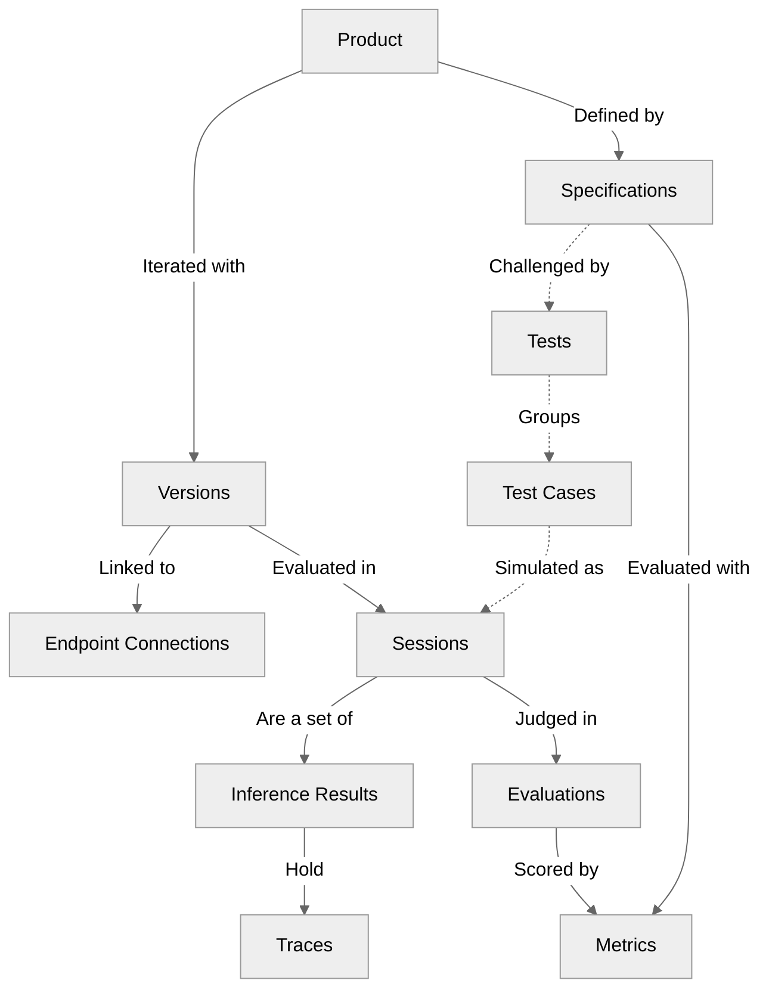

import ProductCard from '/snippets/cards/product-card.mdx';
import SpecificationCard from '/snippets/cards/specification-card.mdx';
import VersionCard from '/snippets/cards/version-card.mdx';
import TestCard from '/snippets/cards/test-card.mdx';
import TestCaseCard from '/snippets/cards/test-case-card.mdx';
import SessionCard from '/snippets/cards/session-card.mdx';
import InferenceResultCard from '/snippets/cards/inference-result-card.mdx';
import TraceCard from '/snippets/cards/trace-card.mdx';
import EvaluationCard from '/snippets/cards/evaluation-card.mdx';
import MetricCard from '/snippets/cards/metric-card.mdx';
import ModelCard from '/snippets/cards/model-card.mdx';
import EndpointConnectionCard from '/snippets/cards/endpoint-connection-card.mdx';

## How Everything Connects

<Info>The dotted lines represent relationships that don't exist for production-based evaluations, where there is no Test or Test Case and the Session is generated from real user interactions.</Info>

<Note>The diagram focuses on core concepts. Some related concepts are omitted for clarity — see the [Additional Notes](#additional-notes) section.</Note>

## At a Glance

Galtea's concepts split into four lifecycle scopes:

- **What you're testing**: Your [Product](/concepts/product), defined by a set of [Specifications](/concepts/product/specification) and iterated on through new [Versions](/concepts/product/version).
- **What you test with**: [Tests](/concepts/product/test) that group [Test Cases](/concepts/product/test/case); your Product's performance against them is measured with [Metrics](/concepts/metric).
- **What your Product generates**: [Sessions](/concepts/product/version/session), each a sequence of [Inference Results](/concepts/product/version/session/inference-result) along with their [Traces](/concepts/product/version/session/trace).
- **How you measure performance**: [Evaluations](/concepts/product/version/session/evaluation) that apply a [Metric](/concepts/metric) to a [Session](/concepts/product/version/session) or to a specific [Inference Result](/concepts/product/version/session/inference-result).

## Additional Notes

A few relationships are easy to misread, and some are omitted from the diagram for clarity. These notes fill in the gaps:

- **Specifications are the glue.** A [Specification](/concepts/product/specification) links to one or more [Metrics](/concepts/metric) so it can be evaluated, and [Tests](/concepts/product/test) can be generated from a Specification to challenge it.
- **Test Case ↔ Session.** A [Test Case](/concepts/product/test/case) belongs to a [Test](/concepts/product/test). When a [Session](/concepts/product/version/session) is generated to simulate a Test Case, it references that Test Case — so the same Test Case can show up across many Sessions (for example, re-running a Test across multiple Versions). Sessions can also be generated without a Test Case, for example when [recording real user interactions](/sdk/tutorials/monitor-production-responses-to-user-queries) to evaluate the Product in production.
- **Endpoint Connections shape Test generation.** When you create a Test with an [Endpoint Connection](/concepts/product/endpoint-connection) selected, the generated Test Cases are produced to match that endpoint's expected input format.
- **Per-turn evaluations.** An [Evaluation](/concepts/product/version/session/evaluation) can target a single [Inference Result](/concepts/product/version/session/inference-result) instead of the whole Session — useful when you want to score, for example, how the agent's output reflected the retrieval context the RAG system provided on that turn. Per-turn Evaluations still belong to the Session that contains the turn; they additionally point at the specific Inference Result being scored.
- **Two types of model.** The standard [Model](/concepts/model) is what your Product runs on — linked to a Version and used to track costs, token usage, and similar. The **evaluator model** is the LLM Galtea uses to perform the judgment for non-deterministic Metrics; it's selected by name on the Metric, not on the Version. See [Models vs. Evaluator Models](/concepts/model#models-vs-evaluator-models) on the Model page for the full distinction.
- **[User Groups](/concepts/user-group) for human evaluation.** A User Group routes [Human Evaluation](/concepts/metric/evaluation-types#human-evaluation) Metrics to a specific set of annotators, so only the right reviewers see those Evaluations on the dashboard.

## All Concepts

<CardGroup cols={3}>
  <ProductCard />
  <SpecificationCard />
  <VersionCard />
  <EndpointConnectionCard />
  <TestCard />
  <TestCaseCard />
  <SessionCard />
  <InferenceResultCard />
  <TraceCard />
  <EvaluationCard />
  <MetricCard />
  <ModelCard />
</CardGroup>
