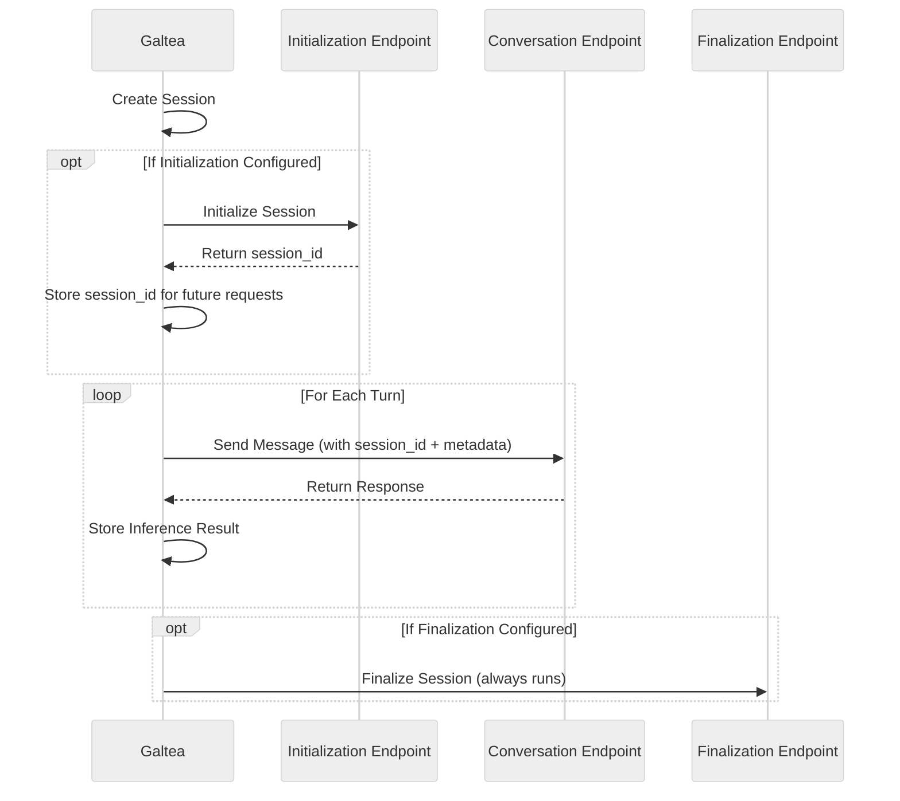

## What is an Endpoint Connection?

An Endpoint Connection tells Galtea how to call your AI system's API. You configure the URL, authentication, request format, and response mapping once, and Galtea uses it to run evaluations against your endpoint automatically.

## Use Cases

- **Automate evaluations** — Galtea calls your endpoint directly for each test case, no manual inference needed
- **Standardize API calls** — Define reusable configurations with consistent auth and request formatting
- **Manage multiple environments** — Create separate connections for development, staging, and production

## Creating an Endpoint Connection

To create an Endpoint Connection:

1. Navigate to your product in the [Galtea Dashboard](https://platform.galtea.ai/)
2. Go to the "Endpoint Connections" section
3. Click "New Endpoint Connection"
4. Configure the connection properties as described below

  <video
    controls
    muted
    playsInline
    className="w-full aspect-video rounded-xl"
    src="/videos/endpoint-connection-setup.mp4"
  ></video>

## Quick Start: Single Conversation Endpoint

Most integrations only need **one Conversation endpoint**. At its simplest, you just need to configure:

- **Input Template** — How to format the request body (using `{{ input.user_message }}` for the simulated user message)
- **Output Mapping** — How to extract your product's AI response (using a JSONPath expression for the `output` key)

<CodeGroup>
```json Input Template
{
  "message": "{{ input.user_message }}"
}
```

```json Output Mapping
{
  "output": "$.response"
}
```
</CodeGroup>

This is all you need to start running evaluations against your endpoint. For advanced template syntax, conversation history loops, state management, and output mapping options, see [Templates & Mapping](/concepts/product/endpoint-connection-configuration).

## Multi-Step Session Lifecycle (Advanced)

Some AI products expose separate endpoints for session setup and cleanup. In those cases, you can configure up to three endpoint connections:

- **Initialization** (optional): runs before conversation
- **Conversation** (required): runs for each turn
- **Finalization** (optional): runs after conversation

### Session Lifecycle Flow

When a version has initialization and/or finalization endpoints configured, the evaluation follows this lifecycle:



### Example Use Case: Multi-Step Chatbot

Some chatbot APIs require multiple steps:

- **Initialization**: create a session and return a `session_id`
- **Conversation**: send messages using that `session_id`
- **Finalization**: clean up the session

In this setup:

- Your **Initialization** connection extracts `session_id` via `outputMapping`.
- Your **Conversation** connection can reuse it in the URL/body using `{{ session_id }}`.
- Any additional fields extracted via `outputMapping` are stored in **session metadata** and can also be reused in later turns.

## Endpoint Connection Properties

<ResponseField name="Name" type="Text" required>
  A unique name for the endpoint connection within the product. **Example**: "Production Chat API" or "Staging Summarizer"
</ResponseField>

<ResponseField name="Type" type="Enum" required>
  The purpose of the endpoint connection:
  - `INITIALIZATION` - Runs before the conversation
  - `CONVERSATION` - Runs for each turn
  - `FINALIZATION` - Runs after the conversation
</ResponseField>

<ResponseField name="URL" type="Text" required>
  The full URL of the endpoint. Must be a valid HTTP or HTTPS URL. **Example**: "https://api.company.com/v1/chat"
</ResponseField>

<ResponseField name="HTTP Method" type="Enum" required>
  The HTTP method: `GET`, `POST`, `PUT`, `PATCH`, or `DELETE`.
</ResponseField>

<ResponseField name="Auth Type" type="Enum" required>
  Authentication method: `NONE`, `BEARER`, `API_KEY`, or `BASIC`.
</ResponseField>

<ResponseField name="Auth Token" type="Text">
  The authentication token or credentials. This value is securely stored.
</ResponseField>

<ResponseField name="Headers" type="JSON">
  Optional custom headers to include with each request.
</ResponseField>

<ResponseField name="Input Template" type="String (Jinja2)" required>
  A Jinja2 template defining the request body. See [Templates & Mapping](/concepts/product/endpoint-connection-configuration#input-template) for the full placeholder reference and examples.
</ResponseField>

<ResponseField name="Output Mapping" type="JSON" required>
  A JSON object defining how to extract values from the response using JSONPath. See [Templates & Mapping](/concepts/product/endpoint-connection-configuration#output-mapping) for special keys and examples.
</ResponseField>

<ResponseField name="Timeout" type="Number">
  Request timeout in seconds (1–300). Default: 30 seconds.
</ResponseField>

<ResponseField name="Rate Limit" type="Number">
  Optional rate limit for requests per minute.
</ResponseField>

## Best Practices

<AccordionGroup>
  <Accordion title="Use descriptive names">
    Choose names that clearly identify the endpoint's purpose and environment, such as "Production Chat API" or "Staging Document Analyzer".
  </Accordion>

  <Accordion title="Configure appropriate timeouts">
    Set timeouts based on your endpoint's expected response time. For complex AI operations, you may need longer timeouts (60-120 seconds).
  </Accordion>

  <Accordion title="Use retry configuration">
    Configure retries for endpoints that may experience transient failures. Start with 2-3 retries with exponential backoff. See [Retry Configuration](/concepts/product/endpoint-connection-configuration#retry-configuration).
  </Accordion>

  <Accordion title="Secure your credentials">
    Never share your auth tokens. Galtea securely stores and encrypts all authentication credentials.
  </Accordion>
</AccordionGroup>

## Related

<CardGroup cols={2}>
  <Card title="Templates & Mapping" icon="code" href="/concepts/product/endpoint-connection-configuration">
    Full reference for Input Templates, Output Mapping, state management, and retry configuration.
  </Card>
  <Card title="Structured Input Template Syntax" icon="brackets-curly" href="/concepts/product/endpoint-connection-template-syntax">
    Deep dive into `{{ input.field_name }}` and `{{ context.field_name }}` placeholder syntax, JSON escaping, and missing field behavior.
  </Card>
  <Card title="Endpoint Connection Service SDK" icon="plug" href="/sdk/api/endpoint-connection/service">
    Manage endpoint connections programmatically using the Python SDK.
  </Card>
  <Card title="Version" icon="code-branch" href="/concepts/product/version">
    Attach endpoint connections to a version for evaluation.
  </Card>
  <Card title="Direct Inferences Tutorial" icon="play" href="/sdk/tutorials/direct-inferences-and-evaluations-from-platform">
    Run evaluations from the dashboard using your endpoint connection.
  </Card>
</CardGroup>
