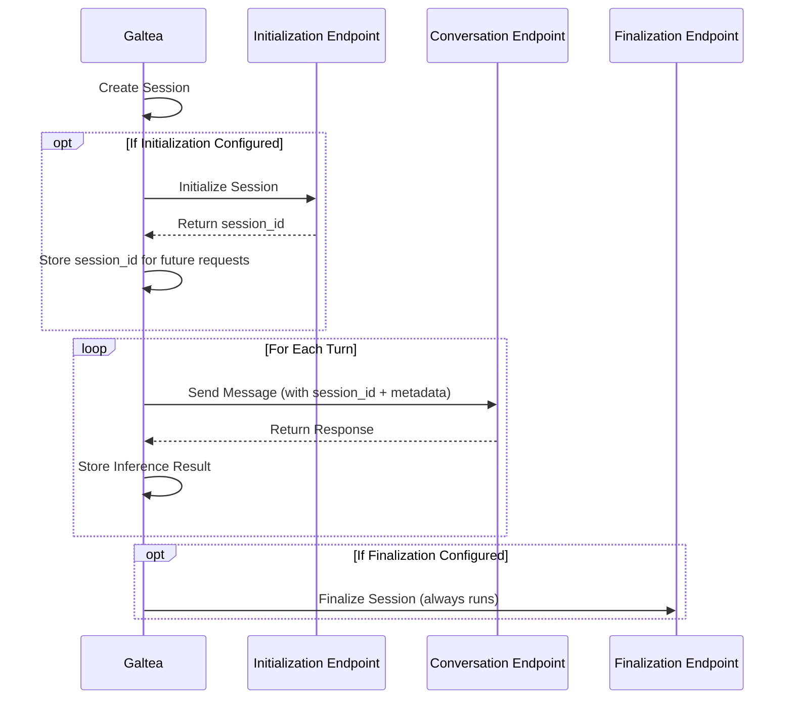

import SDKVersionServiceCard from '/snippets/cards/sdk-version-service-card.mdx';

## What is a Version?

A version in Galtea represents a specific iteration of a [product](/concepts/product). Versions allow you to track changes to your product over time and compare different implementations against the same tests.

You can **create**, view and manage your versions on the [Galtea dashboard](https://platform.galtea.ai/) or programmatically using the [Galtea SDK](/sdk/api/version/service).

## Comparing Versions

One of the key benefits of tracking versions in Galtea is the ability to compare different implementations of your product. This allows you to:

- Measure improvements between versions
- Identify regressions in newer versions
- Compare different model providers or approaches
- Make data-driven decisions about which version to deploy

<Card title="Run Evaluations" icon="clipboard-check" iconType="solid" href="/concepts/product/version/session/evaluation">
  Learn how to run evaluations for your versions
</Card>

## SDK Integration

The Galtea SDK allows you to create, view, and manage versions programmatically. This is particularly useful for organizations that want to automate their versioning process or integrate it into their CI/CD pipeline.

<CardGroup cols={2}>
  <SDKVersionServiceCard />
  <Card title="GitHub Actions" icon="code-compare" href="/sdk/integrations/github-actions">
    Learn how to set up GitHub Actions to automatically create new versions and evaluate them
  </Card>
</CardGroup>

## Version Properties

<ResponseField name="Version Name" type="Text" required>
  The name of the version. **Example**: "v1.2.0" or "GPT-4 Implementation"
</ResponseField>

<ResponseField name="Version Description" type="Text">
  A description of the version, typically highlighting what makes it different from other versions. **Example**: "Improved summarization algorithm with better fact retention"
</ResponseField>

<ResponseField name="Model" type="Model" required>
  The AI [Model](/concepts/model) used by this version. This is used for cost tracking and associating the version with a specific LLM's pricing and tokenization characteristics.

  This is used to calculate the cost of the inference for the version during [evaluations](/concepts/product/version/session/evaluation).
</ResponseField>

<ResponseField name="System Prompt" type="Text">
  The system prompt used for this version. **Example**: "You are an expert legal document summarizer. Provide concise summaries that capture all key legal points."
</ResponseField>

<ResponseField name="Dataset URI" type="Text">
  The URI of the dataset used to train or fine-tune this version. **Example**: "s3://company-datasets/legal-documents-v2/"
</ResponseField>

<ResponseField name="Dataset Description" type="Text">
  A description of the dataset used in the version. **Example**: "Collection of 10,000 legal contracts and agreements with expert-created summaries"
</ResponseField>

<ResponseField name="Guardrails" type="Text">
  The guardrails applied to the version, separated by commas. **Example**: "content filtering, citation checking, legal compliance"
</ResponseField>

<ResponseField name="Conversation Endpoint Connection" type="EndpointConnection">
  The primary [Endpoint Connection](/concepts/product/endpoint-connection) used for the main conversational interactions with your AI product. This is the only required endpoint connection.
  
  **Used for**:
  - Sending user messages
  - Receiving AI responses
  - (Often) creating and maintaining the external session state
</ResponseField>

<ResponseField name="Initialization Endpoint Connection" type="EndpointConnection">
  An optional [Endpoint Connection](/concepts/product/endpoint-connection) executed **before** the conversation begins. Used to initialize a session with your AI product.
  
  **Used for**: 
  - Creating a session on the external API
  - Obtaining a session ID that will be used in subsequent conversation calls
  - Setting up initial context or configuration
  
  <Note>
    The initialization endpoint **must** return a `session_id` in its response. Configure the `outputMapping` with a `session_id` key pointing to the session identifier in the response. This value is stored in Galtea and made available in subsequent calls via `{{ session_id }}`.
  </Note>
</ResponseField>

<ResponseField name="Finalization Endpoint Connection" type="EndpointConnection">
  An optional [Endpoint Connection](/concepts/product/endpoint-connection) executed **after** the conversation ends (including after errors). Used to clean up resources on your AI product.
  
  **Used for**:
  - Closing sessions on the external API
  - Releasing resources
  - Triggering post-conversation processing
  
  <Note>
    The finalization step runs in a `finally` block, meaning it executes even if the conversation encounters an error. Errors in the finalization step are logged but do not fail the overall evaluation.
  </Note>
</ResponseField>

## Endpoint Connections

The **Conversation Endpoint Connection** is the **main** way Galtea talks to your AI system.
Therefore, this property is the only one required to generate inferences from the platform.

In many products, a **single Conversation endpoint** is enough to handle:

- **Session creation**
- **Conversation turns**
- **Carrying state between requests**

<Note>
  Only when your product requires separate endpoints for setup or cleanup, you can optionally add **Initialization** and/or **Finalization** endpoint connections. See [Multi-Step Session Lifecycle (Advanced)](#multi-step-session-lifecycle-advanced) for details.
</Note>

### Single Conversation Endpoint

Most integrations only need **one Conversation endpoint**. At its simplest, you just need to configure:

- **Input Template** — How to format the request body (using `{{ input }}` for the simulated user message).
- **Output Mapping** — How to extract your product's AI response (using a JSONPath expression for the `output` key).

#### Basic example (stateless)

For a simple API that doesn't require session state:

<CodeGroup>
```json Input Template
{
  "message": "{{ input }}"
}
```

```json Output Mapping
{
  "output": "$.response"
}
```
</CodeGroup>

This is all you need to start running evaluations against your endpoint.

#### State management (extracting and reusing values)

If your API returns values that need to be sent in subsequent requests (e.g., `session_id`, `tenant_id`), Galtea can automatically manage this state:

1. **Extract** — Use `outputMapping` to pull values from the API response using [JSONPath](https://goessner.net/articles/JsonPath/) expressions.
2. **Store** — Extracted values are saved in the session and become available as template variables.
3. **Reuse** — Reference any stored value in the `inputTemplate` or URL using `{{ variable_name }}` syntax.

<Tip>
  On the first turn, undefined placeholders resolve to empty strings. After the first response, all extracted values become available for subsequent turns.
</Tip>

**Example:** capture `session_id` and `tenant_id` from responses:

<CodeGroup>
```json Output Mapping
{
  "output": "$.text",
  "session_id": "$.session_id",
  "tenant_id": "$.tenant"
}
```

```json Input Template
{
  "role": "user",
  "content": "{{ input }}",
  "session_id": "{{ session_id }}",
  "tenant": "{{ tenant_id }}"
}
```
</CodeGroup>

#### Special keys in Output Mapping

| Key | Behavior |
|-----|----------|
| `output` | **Required.** The AI's response content. |
| `session_id` | Stored as the external session identifier, accessible via [`custom_id`](/concepts/product/version/session#session-properties). |
| `retrieval_context` | Stored as retrieval context for RAG evaluations. |
| Any other key | Stored in session metadata and available as `{{ key }}` in templates. |

<Info>
  For the full list of available template variables and detailed configuration options, see [Endpoint Connection — Input Template](/concepts/product/endpoint-connection#input-template).
</Info>

### multi-step session lifecycle (Advanced)

Some AI products expose separate endpoints for session setup and cleanup. In those cases, you can configure up to three endpoint connections:

- **Initialization** (optional): runs before conversation
- **Conversation** (required): runs for each turn
- **Finalization** (optional): runs after conversation

### Session Lifecycle Flow

When a version has initialization and/or finalization endpoints configured, the evaluation follows this lifecycle:



### Example Use Case: Multi-Step Chatbot (high level)

Some chatbot APIs require multiple steps:

- **Initialization**: create a session and return a `session_id`
- **Conversation**: send messages using that `session_id`
- **Finalization**: clean up the session

In this setup:

- Your **Initialization** connection extracts `session_id` via `outputMapping`.
- Your **Conversation** connection can reuse it in the URL/body using `{{ session_id }}`.
- Any additional fields extracted via `outputMapping` are stored in **session metadata** and can also be reused in later turns.