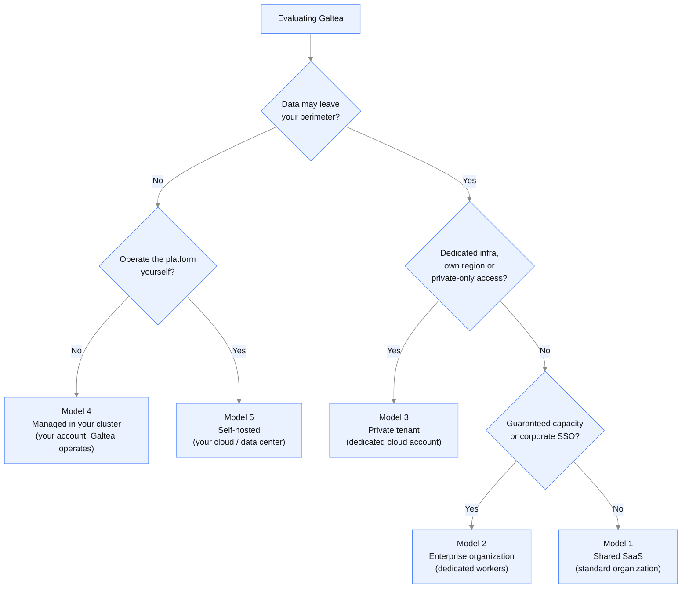

{/* Generated by galtea-docs from Galtea-AI/gitops docs/deployment at deployment-guide-v1.2.0. Do not edit here: change the source page and release the guide. */}

Four questions decide the model. Answer them in order and stop at the first one that
forces your hand.

## 1. Can the data leave your infrastructure at all?

If a written policy says test data, prompts or evaluation results must never leave your own
cloud subscription or data center, the platform has to run in your account. One more question
picks between the two models that fit.

**Does your team want to operate the platform?** If not, the answer is **managed in your
cluster (model 4)**: your account, your network, your data, with Galtea deploying and operating
the platform on it and your team able to approve each change first. If yes, or if no third
party may hold any operational role at all, the answer is **self-hosted (model 5)**.

If the data may sit in Galtea-operated infrastructure under a contract, continue.

## 2. Do you need dedicated infrastructure or a specific region?

If you need a dedicated cloud account, a specific region for data residency, your own
database and storage, or a network you control, the answer is **private tenant
(model 3)**. Galtea still operates it, so your team takes on no Kubernetes work.

If shared, logically isolated infrastructure is acceptable, continue.

## 3. Do you need guaranteed capacity or your own identity provider?

Evaluations and data generation are the compute-heavy part of the platform. If you need
them processed with priority and never queued behind other customers, or you need your
users to sign in through your corporate identity provider with your own MFA policy, the
answer is **enterprise organization (model 2)**.

## 4. Otherwise

**Shared SaaS (model 1)**. Fastest to start, zero infrastructure on your side, always on
the latest version.

## Decision path

## Common misreadings

**"Shared means other customers can see our data."** No. In the shared models every
record (products, tests, evaluations, results) is scoped to one organization, and every
request is checked against the caller's organization and role. Organizations never see
each other's data. What is shared is the compute and the database instance, not the data
visibility.

**"Self-hosted is the most secure option."** Not automatically. Self-hosted moves the
responsibility to you: patching, backups, monitoring, capacity and incident response become
your team's work, and a platform nobody has time to operate is less secure, not more. If the
requirement is that data stays in your account, **model 4 satisfies it without that transfer**:
same perimeter, Galtea still operating the platform. If the requirement is dedicated
infrastructure rather than your own account, a private tenant gives you that with no
infrastructure work at all.

**"We must pick one forever."** No. The models sit on one axis of isolation, and the
product surface is identical. Starting on shared SaaS for a pilot and moving to a private
tenant for production is a normal path.

## Cost and effort, qualitatively

| Model | Your infrastructure cost | Your operational effort | Lead time |
|-------|--------------------------|-------------------------|-----------|
| 1. Shared SaaS | None | None | Immediate |
| 2. Enterprise organization | None | None, plus your IdP setup | Hours |
| 3. Private tenant | None: included in the tenant contract | Network and IdP coordination only | Days |
| 4. Managed in your cluster | Full: cluster, database, storage, LLM provider | Infrastructure only; Galtea operates the platform | Days, once your cluster exists |
| 5. Self-hosted | Full: cluster, database, storage, LLM provider | Full platform operation | Weeks, plus your change process |
