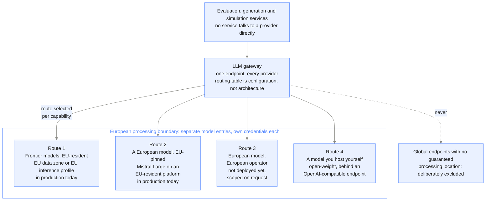

{/* Generated by galtea-docs from Galtea-AI/gitops docs/deployment at deployment-guide-v1.2.0. Do not edit here: change the source page and release the guide. */}

The platform is cloud-agnostic in design: it needs a conformant Kubernetes cluster, a
PostgreSQL database, an object store and outbound HTTPS. Everything cloud-specific sits
behind a configuration switch.

Being honest about the difference between *designed to be portable* and *validated in
production* matters here, so this page states the level of each target explicitly.

## Support levels

| Target | Level | What that means |
|--------|-------|-----------------|
| **AWS EKS** | Validated in production, Galtea-operated | Galtea's own shared SaaS and every private tenant run here, so the charts are continuously exercised. The customer deployment repository for a **self-hosted** AWS install is not published yet, so ask for the timeline for your deployment. |
| **Azure AKS** | Validated for self-hosted | The self-hosted deployment package is built and tested for AKS, decoupled from AWS services. |
| **Google GKE** | Supported as an adaptation | No hard blocker known. Object storage, secret storage and workload identity need mapping and testing per deployment. |
| **OpenShift and other conformant Kubernetes** | Supported as an adaptation | Same as GKE, plus OpenShift security-context constraints need review. |
| **Air-gapped / no registry access** | By agreement | Requires mirroring images and charts into your internal registry. |

"Supported as an adaptation" means Galtea will do it with you as a scoped piece of work, with a
timeline, not that you can run the package unchanged today.

## Service equivalences

Which cloud *hosts* the platform and which provider *serves the models* are independent
questions, easy to conflate. Galtea's own platform runs on AWS and calls Azure OpenAI
for most of its inference. So a deployment on AWS or GCP calling Azure OpenAI is the normal
arrangement, not a workaround, and "we are an Azure shop" or "we are a GCP shop" does not by
itself decide either question. See the LLM provider section below.

The platform needs the capability in the left column. The rest of the table is what provides
it on each cloud.

**Managed services are the recommendation, self-hosted equivalents are supported.** For the
database, the object store, the broker and the cache, the platform speaks the standard
protocol, so a compatible self-hosted component works. Galtea recommends the provider's
managed service where one exists, because it moves backups, patching, failover and storage
growth off your team. See
[Reference architecture](/deployment/reference-architecture) for the reasoning and the exceptions.

| Capability | AWS | Azure | Other Kubernetes |
|------------|-----|-------|------------------|
| Kubernetes | EKS | AKS | Any conformant distribution, 1.28+ |
| Relational database | Amazon RDS for PostgreSQL | Azure Database for PostgreSQL | Cloud SQL, or any PostgreSQL 14+ you run yourself |
| Object storage | Amazon S3 | Azure Blob Storage | Google Cloud Storage, or any S3-compatible store you run yourself, such as MinIO or Ceph |
| Container images and Helm charts | One AWS ECR registry in `eu-west-1` serves both as OCI artifacts, with read-only IAM credentials issued per customer | Same registry, pulled from Azure with the token-refresh CronJob the package ships | Same, or both mirrored into your own OCI registry |
| Secret storage | External Secrets Operator with AWS Secrets Manager | Plain Kubernetes secrets, or your own secret operator | Plain Kubernetes secrets, or your own operator |
| Workload identity | EKS Pod Identity or IRSA | Azure Workload Identity | Whatever your distribution offers. Static credentials in a secret work, but are the fallback, not the target |
| Ingress and TLS | Application Load Balancer with ACM certificates | Any ingress controller with your certificate | Any ingress controller with your certificate |
| Worker autoscaling | KEDA on queue depth | KEDA, optional | KEDA, optional. Without it, fixed replica counts. |
| Node autoscaling | Karpenter | AKS cluster autoscaler, or fixed node pools | Whatever your distribution provides, or fixed nodes |
| Web application firewall | AWS WAF | Azure Front Door or Application Gateway WAF | Yours |
| LLM inference | Amazon Bedrock, Azure OpenAI, or others through the gateway | Azure OpenAI | Any provider the gateway supports, including a private model endpoint |

## Topology per validated cloud

Both diagrams are generated from code, so they stay in step with the architecture. PNG for
documents, SVG for slides.

**Private tenant on AWS**: the managed target, a dedicated account, private VPC across
three availability zones, controlled egress with a hostname allowlist, and the optional
VPN-only entry path.

<Frame caption="Private tenant on AWS">
  
</Frame>

**Self-hosted on Azure AKS**: the customer-operated target, everything inside the
customer's subscription, with the only Galtea link being an image and chart pull at install
and upgrade time.

<Frame caption="Self-hosted on Azure AKS">
  
</Frame>

## AWS notes

- This is the reference implementation. Private tenants are deployed as a dedicated AWS
  account per customer, with a private VPC across three availability zones.
- Outbound traffic leaves through an egress control layer with a destination allowlist and
  one NAT gateway per availability zone. Fixed egress IPs are available on request. See
  Model 3 ([Private tenant](/deployment/model-private-tenant)).
- Private connectivity can use VPC peering or private-link endpoints instead of internet
  egress **when your own network is on AWS**. For any other cloud or an on-premise network,
  the VPN is the private path.

## Azure notes

- The self-hosted package is the validated Azure path. It deliberately avoids AWS-only
  building blocks so it installs on a plain AKS cluster.
- **Workload identity** is the recommended way to give the platform access to Blob Storage,
  so no storage key is stored in the cluster. Key-based access with a connection string
  also works. The deployment package includes the step-by-step setup notes for both.
- **Blob Storage reachability is the single most common setup mistake.** File uploads go
  directly from the user's browser to the blob endpoint using a signed URL. If the network
  your users sit on cannot resolve or reach that endpoint, or CORS is not configured for a
  cross-origin `PUT` from your dashboard origin, creating a test with an attached file
  appears to hang with no obvious error. Both must be configured before go-live.
- Azure OpenAI model availability differs by region and subscription. If your approved
  model set differs from the package default, the gateway configuration and the per-service
  model settings are adjusted to match. Regulated environments that allow only an approved
  subset are a normal case.

## Google Cloud and other Kubernetes

No architectural blocker is known. The work to scope per deployment:

1. Object storage: either Google Cloud Storage through its S3-compatible interface, or a
   self-run S3-compatible store.
2. Workload identity: mapping the platform's service accounts to your mechanism.
3. Ingress and certificates: your controller, your certificates.
4. LLM provider: Vertex AI is supported through the gateway.
5. A test cycle in your environment before go-live.

## The LLM provider is a separate decision

The gateway is provider-agnostic by design, and Galtea's own platform routes across Azure
OpenAI, Vertex AI, OpenAI, Bedrock and others, with automatic failover between them. What
matters for your deployment is narrower:

- **The self-hosted package ships configured for Azure OpenAI out of the box**: every model
  the default routing table points to is an Azure deployment, and it expects an EU data-zone
  endpoint. **Any model provider can be connected to Galtea** through the LiteLLM gateway
  configuration, and the other providers are already present in the shipped configuration as
  commented-out entries you can enable.
- **This holds regardless of which cloud you deploy on.** An installation on AWS or GCP still
  calls Azure OpenAI for its models, which is only a cross-cloud HTTPS call.
- **Consolidating production traffic on one primary provider is the recommendation**, because
  it keeps one set of data-processing terms, one region story and one quota to manage instead of
  several.
- **Authenticate by identity where the provider supports it** rather than by long-lived API key.
- If your approved model set differs from the package default, the routing table and the
  per-service model settings are adjusted to match. Regulated environments that allow only an
  approved subset are a normal case.

Tell Galtea which provider and which models you are allowed to use before the deployment is
designed. It is the single configuration item most likely to differ from the default.

### European models, EU-only processing, and the difference between them

Customers arrive with one of two requirements, and they are not the same. Getting them mixed up
is how a deployment passes one review and fails the next.

- **"Our data must not leave Europe."** A requirement about *where the processing happens*. Any
  provider satisfies it if the model is served from an EU-resident deployment.
- **"Our providers must be European."** A requirement about *who the processor is*, usually
  driven by concern about non-EU legal reach over a US-headquartered company. An EU region of a
  US provider does **not** satisfy this, even though the bytes never leave Europe.

Four routes, and what each one actually satisfies:

| Route | Data stays in Europe | Processor is European | No third-party processor |
|-------|:---:|:---:|:---:|
| **1. EU-resident deployment of a frontier model**: EU data zone on Azure, EU inference profiles on Bedrock, EU regional endpoints on Vertex | Yes | No | No |
| **2. A European model on one of those platforms**: Mistral Large, EU-pinned | Yes | Model yes, platform no | No |
| **3. A European model served by a European operator**: the provider's own EU endpoint, or an EU-based host | Yes | Yes | No |
| **4. An open-weight model you host yourself**: in your own cluster or account, behind an OpenAI-compatible endpoint | Yes | n/a | Yes |

Routes 1 and 2 are in production today.
**Route 3 has not been deployed for anyone yet**: no customer has needed a
European operator rather than a European model on an EU-resident platform, so it would be
scoped with you rather than switched on. Raise it early if it is a hard requirement, because it
means selecting and contracting an operator, not changing a routing table. Route 4 is available
in a private tenant or a self-hosted install and is the only one where no third party processes
your data at all.

**What an EU-only tenant looks like in practice.** Every route is
pinned, and pinned differently depending on what the provider offers:

- Most traffic goes to an **EU data zone deployment**, with credentials that exist only for that
  deployment.
- Anthropic models go through **EU cross-region inference profiles**, and where a model is only
  offered as a single-region id, the id used is the EU-region one, noted as such so nobody
  later mistakes it for a cross-region profile.
- Google models are split across **two EU pins**: a specific European region for most, and the
  EU multi-region residency endpoint for newer models that region does not serve yet. Neither is
  the global endpoint.
- A **European model**, Mistral Large, is available on the same EU data zone.
- The gateway also **publishes the global model name and routes it to the EU deployment**,
  so a service that asks for the global variant still gets the European one instead of silently
  leaving the region.

That is the level of specificity a compliance review needs, and it is per model rather than a
single global switch. It is also why the requirement has to be stated before the deployment is
configured: retrofitting it means revisiting every entry in the routing table.

**Flexibility is the point.** The gateway is a single internal endpoint in front of every
provider, so the routing table is configuration, not architecture. That means the choice is made
per capability rather than once for the whole platform: you can put evaluation on a strictly
European route and leave a less sensitive capability on the default one, or restrict everything
to a single approved provider. Changing it later is a configuration change, not a migration.

How the strict options are enforced rather than promised:

- **EU-pinned models are separate entries in the gateway**, named distinctly from the default
  ones, with their own provider credentials. Selecting an EU route is selecting a different
  route, not trusting a flag.
- **Endpoints with no guaranteed processing location are excluded** for enterprise tenants. Some
  providers offer a cheaper global endpoint that gives no residency guarantee; it is not used.
- **The allowed set can be restricted** so that no service can fall back outside it.

That last point needs a deliberate decision, because it is a genuine trade-off: automatic
failover between providers protects availability and can move a request to another provider,
which is exactly what a strict residency or sovereignty requirement forbids. You can have
strong availability or a strict guarantee, not both at full strength. Tell Galtea which one wins and
it is configured that way, per capability if that helps.

## Cloud-independent guarantees

Regardless of target:

- No cloud-provider feature is required for the platform to function. Autoscaling, managed
  secrets and managed certificates are all optional improvements.
- **Workload identity rather than stored credentials** wherever the cloud offers it, so no
  long-lived key for storage or secrets sits in the cluster. This is the expected configuration
  in every Galtea-operated deployment.
- The charts are published, versioned artifacts. They install with plain Helm on a bare
  cluster, and with ArgoCD if you run GitOps.
- One container image set serves every target. There is no per-cloud fork of the product.
