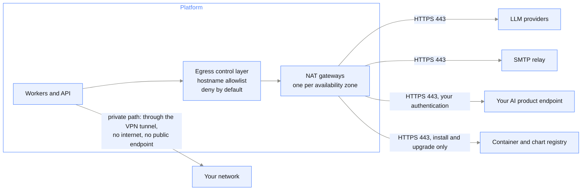

{/* Generated by galtea-docs from Galtea-AI/gitops docs/deployment at deployment-guide-v1.2.0. Do not edit here: change the source page and release the guide. */}

This is the page for the engineer wiring the deployment up. It answers "how do I": inbound
ingress and certificates, the outbound routes and how each is set up, egress allowlist
mechanics, and the storage reachability and CORS work that go-live depends on. The policy
behind all of it, and the answers a security review needs, are in
[Security assurance](/deployment/security-assurance). The complete list of outbound destinations,
with hostnames, ports and when each fires, is in
[Outbound connectivity reference](/deployment/connectivity-reference): this page does not restate
it, so allowlist from that table rather than from prose.

## Inbound: ingress, TLS and DNS

What you set up so users and CI reach the dashboard and API:

- [ ] An ingress controller or cloud load balancer in front of the platform APIs release.
      On AWS the Load Balancer Controller or nginx; on Azure Application Gateway or nginx.
- [ ] A TLS certificate for the dashboard and API hostnames: Certificate Manager on AWS,
      Key Vault on Azure, or one you provide.
- [ ] DNS records for those hostnames, resolvable from your users' network.

The ingress and TLS settings live in the platform APIs values file, which is one of the two
per-cloud files: see [Installation examples: AWS and Azure](/deployment/installation-examples).
In a private tenant with private-only access there is no public ingress at all; the entry
path is the VPN, set up per [Connecting to the Galtea VPN](/deployment/connecting-to-the-galtea-vpn).

## Outbound: the two routes to your AI product

When the platform calls the system under test, the traffic first crosses the egress control
layer, so the destination allowlist, the endpoint authentication and the TLS policy apply the
same on both routes:

Note the last edge. In a private tenant, the call to your AI product has **two supported
routes, and the VPN is a first-class option for the outbound direction, not only for the
inbound one**:

- **Through the NAT gateway farm**, over the internet, with your endpoint published and
  optionally restricted to the Galtea egress IPs.
- **Through the VPN tunnel**, in which case your endpoint needs no public address and no
  inbound internet rule, because the call arrives from inside your own network. Setting the
  tunnel and the routes up is [Connecting to the Galtea VPN](/deployment/connecting-to-the-galtea-vpn).

Pick the NAT route when your endpoint already has a public, TLS-protected URL and IP
restriction is enough. Pick the VPN route when the endpoint must stay private, or when
publishing it at all is the thing your policy forbids. Both are fully supported; see
Model 3 ([Private tenant](/deployment/model-private-tenant)) for the
side-by-side comparison.

Properties of the NAT path you configure around:

- **Highly available.** One NAT gateway per availability zone, across three zones. Losing a
  zone does not sever outbound connectivity and does not change your allowlisted IPs.
- **Egress IPs.** Dynamic by default; fixed egress IPs on request, so you can allowlist a
  small predictable set of source addresses. Ask for them before you write your firewall
  rules, not after.

## Allowlist mechanics: registering an endpoint

Only endpoints you register are allowlisted, and the platform cannot call anything else. To
register one, provide:

- [ ] The endpoint hostnames of your AI product, for the egress allowlist.
- [ ] The authentication method the endpoint requires: basic authentication, an API key
      header or a bearer token.
- [ ] The credentials themselves. They are held in a managed secret store and injected at
      call time, never hardcoded and never in an image.
- [ ] If routing through the VPN: the private range or service to advertise, agreed per
      [Connecting to the Galtea VPN](/deployment/connecting-to-the-galtea-vpn).

In a self-hosted install the same list is yours to enforce: the cluster's outbound paths are
your firewall's to control, and the destinations to allow are exactly the rows in
[Outbound connectivity reference](/deployment/connectivity-reference).

## Object storage reachability and CORS

File uploads go **directly from the user's browser** to the object storage endpoint using a
signed URL rather than through the API. An upload path through the API, for networks whose
policy forbids a browser connection to a storage endpoint, is on the roadmap: ask for its
current status rather than planning around it. With the direct path, two things must be
configured before go-live, on every cloud:

- [ ] The network your users sit on can resolve and reach the storage endpoint over
      HTTPS 443.
- [ ] CORS on the storage account or bucket allows a cross-origin `PUT` from your
      dashboard's origin.

Miss either and a test upload appears to hang with no error in any pod log, which is why this
is the single most common setup mistake. The exact values, and the storage selection trap
that comes with them, are in
[Installation examples: AWS and Azure](/deployment/installation-examples). Test an upload from a
browser on your users' network, not from a machine next to the cluster.

## Cluster network policies

Inside the cluster, the platform's namespaces are separated per function with network
policies between them; that layout ships with the charts. What remains yours in a self-hosted
install is the boundary of the cluster itself: outbound firewall rules per
[Outbound connectivity reference](/deployment/connectivity-reference), the database firewall
allowing the cluster's node subnet, and inbound rules for your ingress. The database and
storage firewall items are listed with the rest of the preparation work in
[Prerequisites checklist](/deployment/prerequisites-checklist).
