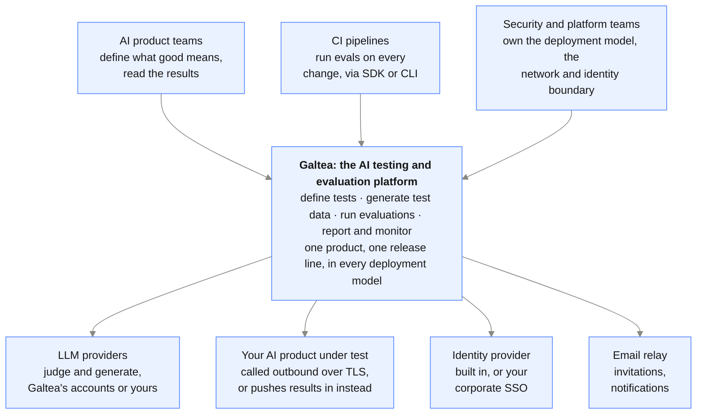

{/* Generated by galtea-docs from Galtea-AI/gitops docs/deployment at deployment-guide-v1.2.0. Do not edit here: change the source page and release the guide. */}

Galtea runs in five deployment models. All five run **the same product from the same
release line**: the features, the SDK and the APIs behave identically. Moving between
models is a deployment change, not a migration to a different product.

The models differ in one dimension only: **how much is isolated for you, and who
operates it.**

**What is isolated**

| Model | Dashboard and API | Workers | Database and object storage |
|---|---|---|---|
| 1. Shared SaaS | Shared | Shared pools | Shared, logically isolated |
| 2. Enterprise org | Shared | Dedicated pools | Shared, logically isolated |
| 3. Private tenant | Dedicated | Dedicated | Dedicated |
| 4. Managed in your cluster | Yours | Yours | Yours |
| 5. Self-hosted | Yours | Yours | Yours |

**Who owns and operates it**

| Model | Cloud account | Who operates the platform | Who operates the infrastructure |
|---|---|---|---|
| 1. Shared SaaS | Galtea | Galtea | Galtea |
| 2. Enterprise org | Galtea | Galtea | Galtea |
| 3. Private tenant | Dedicated, per customer | Galtea | Galtea |
| 4. Managed in your cluster | Yours | **Galtea** | **You** |
| 5. Self-hosted | Yours | You, with Galtea support | You |

**Network, data and inference**

| Model | Network exposure | Where the data lives | LLM inference |
|---|---|---|---|
| 1. Shared SaaS | Public, HTTPS + WAF | eu-west-1 | Galtea's providers |
| 2. Enterprise org | Public, HTTPS + WAF | eu-west-1 | Galtea's providers |
| 3. Private tenant | Private network, VPN-only option | The region you choose | Configurable per tenant |
| 4. Managed in your cluster | Your network policy | Your infrastructure | Your provider accounts |
| 5. Self-hosted | Your network policy | Your infrastructure | Your provider accounts |

**Cost, time and clouds**

| Model | Who pays the cloud bill | Time to start | Clouds |
|---|---|---|---|
| 1. Shared SaaS | Included | Immediate | n/a (managed) |
| 2. Enterprise org | Included | Hours | n/a (managed) |
| 3. Private tenant | Included in the tenant contract | Days | AWS (validated) |
| 4. Managed in your cluster | You | Days, once your cluster exists | Azure AKS (validated), AWS EKS, others on request |
| 5. Self-hosted | You | Weeks, plus your change process | Same as model 4 |

The cloud you deploy on and the provider that serves the models are separate decisions. The
self-hosted package ships configured for **Azure OpenAI out of the box**, on any cloud, and
**any model provider can be connected to Galtea** through the LiteLLM gateway configuration.
See [Cloud-specific details](/deployment/cloud-specifics).

## Which one is for you

- **Shared SaaS**: the default. Nothing to install, always on the latest version.
  Choose it unless a written policy prevents it.
- **Enterprise organization**: same SaaS, but your evaluation and generation jobs run on
  worker pools reserved for you. Choose it when you need predictable capacity for heavy or
  time-sensitive workloads, or when you need to sign in through your own corporate
  identity provider.
- **Private tenant**: a complete, single-customer copy of the platform in a dedicated
  cloud account, with its own network, database, storage and identity provider, and the
  option of no public exposure at all. Choose it for strict compliance, data-residency or
  network-control requirements, without taking on the operational work.
- **Managed in your cluster**: the infrastructure is yours, the platform operation is
  Galtea's. You provide the cloud account, network and Kubernetes cluster; Galtea deploys,
  upgrades and keeps the platform healthy on it, optionally with your team approving each
  change before it reaches production. Choose it when the data must stay in your account but
  you do not want your platform team operating a product they did not build. **This is where
  most enterprises land.**
- **Self-hosted**: the platform runs inside your own cloud subscription or data center, on
  your Kubernetes cluster, operated by your team. Choose it when no third party may hold any
  operational role at all.

## What does not change across models

- The product surface: dashboard, REST API, Python SDK and CLI.
- The release line: the same versioned images and Helm charts.
- Encryption in transit and at rest.
- Role-based access control inside an organization.
- The option to sign in through your own identity provider (SAML or OIDC) from model 2
  onward.

## The platform in one picture

What Galtea is, who uses it, and what it connects to. Identical in all five deployment
models; every diagram on the following pages zooms into part of it.

The deployment boundary is the only thing that changes: everything in this picture runs the
same way whether the platform is a shared multi-tenant service or an installation inside your
own data center. What moves between the five models is the line between what Galtea operates
and what you operate.

## What to read next

- Deciding between models: [Choosing a deployment model](/deployment/choosing-a-model)
- What the platform is made of: [Reference architecture](/deployment/reference-architecture)
- Security and network questions: [Security assurance](/deployment/security-assurance), with the
  setup side in [Connectivity implementation](/deployment/connectivity-implementation)
- Who does what: [Responsibility matrix](/deployment/responsibilities)
