{/* Generated by galtea-docs from Galtea-AI/gitops docs/deployment at deployment-guide-v1.2.0. Do not edit here: change the source page and release the guide. */}

This page applies to the two models where a cluster is involved: a
[private tenant](/deployment/model-private-tenant), which Galtea installs and operates, and a
[self-hosted](/deployment/model-self-hosted) deployment, which you install and operate. In the shared SaaS models there is nothing to install.

## What ships

| Artifact | Where it comes from | Versioning |
|----------|--------------------|------------|
| Container images | Galtea's AWS ECR registry, read-only access granted per customer | Immutable tag per release |
| Helm charts | Published as OCI artifacts and **mirrored into the same ECR registry**, so one credential reaches both | Semantic versioning |
| Values templates | The deployment package, with placeholders to fill | Tracked with the package |
| Secret templates | The deployment package, filled by you and never committed | Tracked with the package |

You pin a version. The images and charts for that version do not change after release.

## Two supported installation methods

Both are tested. This is a deliberate design constraint, not an accident: many customers
have no GitOps tooling, and a chart that only works under a GitOps controller would be
unusable for them.

**Plain Helm**: `helm install` and `helm upgrade`, one release at a time, on a bare
cluster. No GitOps controller, no queue-based autoscaler, no node autoscaler required.
Ordering between components, such as installing a custom resource definition before the
resource that uses it, is handled with Helm hooks rather than any controller-specific
feature. This is the path the self-hosted package documents.

**ArgoCD**: if you already run GitOps, the same chart artifacts are consumed by ArgoCD
applications. This is how Galtea runs its own environments and every private tenant, so it
is the most heavily exercised path.

Chart compatibility rules Galtea holds itself to, so that both paths keep working:

- A consumer pinned to an older chart version keeps working.
- No existing value key is renamed or removed, and no existing default is changed.
- New behavior always arrives behind a switch whose default reproduces the previous
  render, so upgrading a chart version never changes your deployment until you opt in.
- A breaking change is a major version bump, with the reason recorded in the chart
  changelog.

## Install order

```mermaid
%%{init: {'theme':'base','themeVariables':{'fontFamily':'Geist, system-ui, sans-serif','fontSize':'15px','primaryColor':'#eaf1ff','primaryTextColor':'#171717','primaryBorderColor':'#5286ff','secondaryColor':'#eaf8ff','tertiaryColor':'#f1f1ef','lineColor':'#8a8a85','textColor':'#8a8a85','clusterBkg':'transparent','clusterBorder':'#5286ff','titleColor':'#5286ff','edgeLabelBackground':'#eaf1ff'}}}%%
flowchart LR
    P["0. Prerequisites<br/>cluster, database,<br/>storage, registry access"] --> S["1. Secrets<br/>database, storage,<br/>LLM keys, SMTP"]
    S --> I["2. Infrastructure charts<br/>broker, cache,<br/>registry credential refresh"]
    I --> G["3. LLM gateway<br/>provider routing"]
    G --> W["4. Workers<br/>evaluation, generation"]
    W --> A["5. Platform APIs<br/>dashboard, API,<br/>database migration"]
    A --> V["6. Verification<br/>sign in, run a test<br/>end to end"]
```

Steps 2 through 5 are separate Helm releases, so a failure is isolated to one component and
can be retried without touching the rest. Step 5 runs the database schema migration.

A first install brings the workers up before the platform APIs, and an **upgrade** does the
opposite, APIs before workers. That is deliberate rather than an inconsistency, and the reason is
the schema migration:

- **On an upgrade**, the migration has to run before any worker moves onto the new version, so
  the APIs release goes first and the workers follow.
- **On a first install** there is no prior schema and no data to process, so the constraint does
  not exist. The workers simply wait for the schema the APIs release creates.

If you are scripting either one, follow the order for the case you are in rather than assuming one
of the two is a typo. The upgrade procedure is in [Upgrades](#upgrades) below.

The authoritative command-by-command sequence ships with the deployment package, versioned
alongside the charts. For what the work looks like, and for where AWS and Azure differ, see
[Installation examples: AWS and Azure](/deployment/installation-examples). The prerequisites to gather
before starting are summarized in [Prerequisites checklist](/deployment/prerequisites-checklist).

## Upgrades

**Shared SaaS (models 1 and 2).** Continuous. Galtea deploys new versions with no downtime
and no action from you. You are always on the current release.

**Private tenant (model 3).** Your choice of two models, agreed per tenant. Either **managed
by Galtea**, upgraded as new versions ship, like the shared SaaS; or **scheduled with you**,
where you pin a version and Galtea proposes an upgrade, you agree a window, and Galtea applies
and verifies it. In both, Galtea performs the upgrade and owns the rollback.

**Managed in your cluster (model 4).** Galtea runs `helm upgrade` against your cluster, using
credentials you issue, either as versions ship or inside a window you agree. If you already run
GitOps, the change can instead arrive as a pull request your team approves, and nobody at Galtea
touches the cluster. See Model 4
([Galtea-managed in your cluster](/deployment/model-managed-in-your-cluster)).

**Self-hosted (model 5).** Yours to run, on your schedule. Galtea notifies you on Slack, Teams
or a webhook when a version ships, and you can either apply the published charts yourself or
have your own continuous-delivery pipeline consume them from the chart registry:

1. Read the release notes for every version between your current one and the target.
2. Take a database backup and confirm you can restore it.
3. Update the pinned image and chart versions in your values.
4. `helm upgrade` the platform APIs release. The schema migration runs as part of it.
5. `helm upgrade` the workers release.
6. Verify: sign in, run one evaluation end to end.

Rules that avoid the usual upgrade failures:

- **Upgrade one minor version at a time** unless the release notes state that a jump is
  safe. Database migrations are cumulative but are only tested for consecutive versions.
- **Do not run two upgrades concurrently.** The schema migration must not run twice at the
  same time.
- **Keep the APIs and workers releases on the same version.** They share the database
  schema. Running them on different versions is unsupported.
- **Back up before every upgrade.** A schema migration is not automatically reversible.

## Rollback

Rolling back the application is `helm rollback`. Rolling back a **schema migration** is
not automatic: if a release included one, a rollback needs the database restored from the
pre-upgrade backup. This is why the backup step is not optional. Release notes state
explicitly whether a version includes a schema migration.

## Configuration you own

In a self-hosted or private-tenant deployment these are yours to set, and they are the
usual reasons a deployment differs from the default:

| Area | Examples |
|------|----------|
| Capacity | Replica counts per service, worker concurrency, resource requests and limits |
| Models | Which LLM provider and which models each capability uses, and fallbacks |
| Identity | Built-in identity provider, or federation to yours over SAML or OIDC |
| Network | Ingress hostnames, certificates, public or private exposure, egress allowlist |
| Retention | How long results and generated artifacts are kept |
| Email | SMTP relay and sender address |

## Support boundaries

| Situation | Shared SaaS | Private tenant | Self-hosted |
|-----------|-------------|----------------|-------------|
| Product bug | Galtea fixes and deploys | Galtea fixes, ships a version, schedules the upgrade | Galtea fixes and ships a version; you upgrade |
| Install or upgrade problem | n/a | Galtea | Galtea supports, you execute |
| Infrastructure incident | Galtea | Galtea | You, with Galtea support on request |
| Capacity increase | Contract change | Galtea applies | You apply |

*Model 4 reads as the self-hosted column for infrastructure and the private-tenant column for
the platform: you own the cluster and infrastructure incidents, while Galtea still fixes,
ships and applies product bugs and upgrades on it.*
