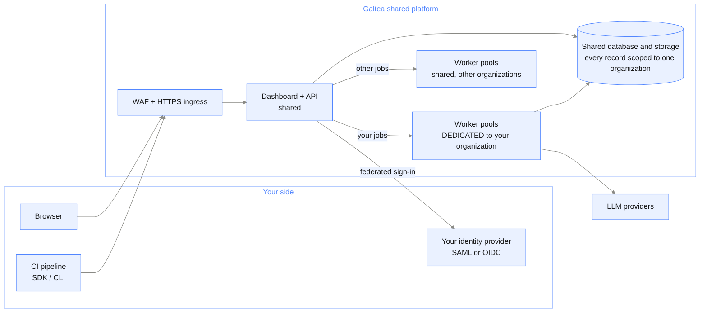

{/* Generated by galtea-docs from Galtea-AI/gitops docs/deployment at deployment-guide-v1.2.0. Do not edit here: change the source page and release the guide. */}

The same managed platform as [model 1](/deployment/model-shared-saas), with two differences that
matter to an enterprise: **your heavy compute runs on worker pools reserved for you**, and
**your users can sign in through your own identity provider**.

Everything else is identical. There is no functional difference in the product, only
guaranteed capacity and enterprise-grade access control.

## What you get, on top of model 1

- **Dedicated worker pools.** Evaluation and generation jobs from your organization are
  routed to worker pools reserved for you. They are processed with priority and are never
  queued behind, or slowed down by, another customer's workload.
- **Your identity provider.** Your users authenticate against your corporate IdP over SAML
  or OIDC. Your password policy, your MFA policy, your conditional access rules.
  Deactivating a user in your IdP removes their access to Galtea.
- **Predictable capacity** sized to your expected volume, agreed in the contract.

## Architecture

## How your identity provider is connected

Galtea federates to your IdP; it does not replace it.

1. You register Galtea as an application in your IdP, over SAML or OIDC.
2. You map your groups to Galtea roles. Group membership in your directory is the source
   of truth for a user's role in Galtea: a change on your side is reflected on the next
   sign-in.
3. Your users reach the Galtea dashboard, are redirected to your IdP, authenticate under
   your policy, including your MFA, and return.
4. Galtea remains authoritative for what a role may do inside the product. Your IdP is
   authoritative for who the user is and which role they hold.

Users with no mapped group are denied access. There is no fallback to a local password for
federated users.

## Where the data lives

Same as model 1: Galtea's cloud account and region, with your data logically isolated per
organization. If you need dedicated storage or a specific region, that is
[model 3](/deployment/model-private-tenant).

## Connectivity you need to allow

Same as [model 1](/deployment/model-shared-saas), plus the standard SAML or OIDC redirect flow
between your users' browsers and your IdP. No inbound connection into your network is
needed: the federation happens in the browser, and Galtea only fetches your IdP's public
signing keys over HTTPS.

## Limits to know

- The dashboard, API and data layer are still shared infrastructure. The isolation is
  logical, as in model 1.
- The platform version is still the current release; you do not pin versions.

## When to choose it

You have heavy or time-sensitive evaluation workloads and cannot accept queueing behind
other tenants, or your security policy requires that all access to third-party
applications goes through your own identity provider and MFA. In both cases, shared
infrastructure itself is acceptable to you.
