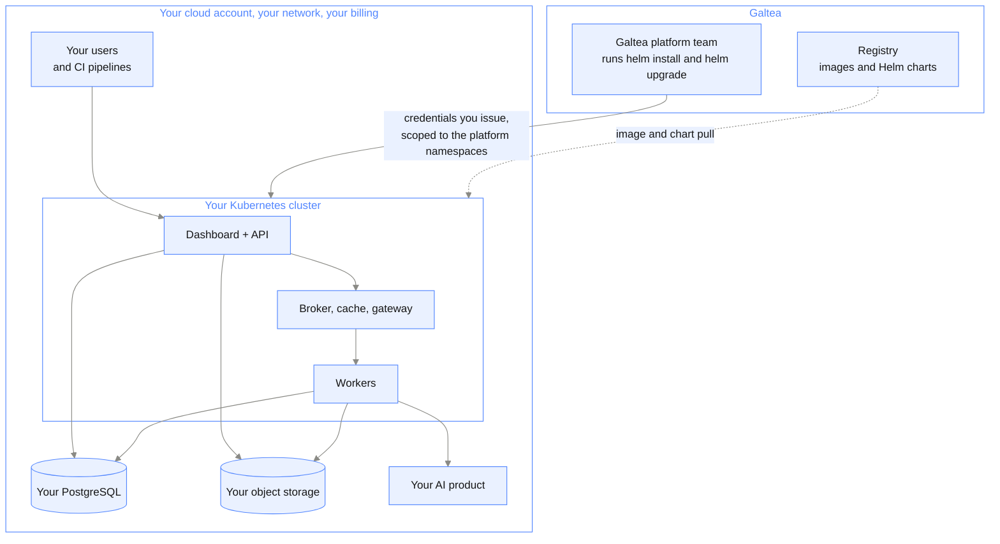

{/* Generated by galtea-docs from Galtea-AI/gitops docs/deployment at deployment-guide-v1.2.0. Do not edit here: change the source page and release the guide. */}

**You provide the cluster. Galtea runs the platform on it.**

The infrastructure is yours: your cloud account, your network, your Kubernetes cluster, your
database and storage, billed to you. What Galtea takes on is the platform itself: deploying it,
upgrading it, and keeping it healthy.

This is the middle ground between a [private tenant](/deployment/model-private-tenant), where Galtea
owns the infrastructure too, and [self-hosted](/deployment/model-self-hosted), where you own the
operations too. In practice it is the model most enterprises land on: the data and the network
stay inside their perimeter, without their platform team having to learn how to operate someone
else's product.

## What you get

- **Your perimeter, your account.** Nothing runs in Galtea-operated infrastructure. Your
  security team owns the network, the IAM and the data governance.
- **Galtea operates the platform.** Installation, upgrades, configuration and health are Galtea's,
  not a runbook your team has to follow.
- **Change control as far as your tooling allows.** By default Galtea upgrades when a version
  ships; scheduling it inside your window is the next step; and if you already run GitOps, a
  release can arrive as a pull request your team approves before anything reaches production.
- **Traceability of what is running.** Every release is a pinned chart and image version, so
  what is deployed is always an exact, reproducible reference, and rolling back is deploying the
  previous one.
- **Much less adoption effort than self-hosted**, because the part that takes real expertise,
  running the platform, does not move to your team.

## Architecture

## How upgrades reach your cluster

Four mechanisms, and you pick the one your change process allows. The first two are what this
model exists for; the last two are also available in
[self-hosted](/deployment/model-self-hosted).

| Mechanism | How it works | What your team does |
|-----------|--------------|---------------------|
| **Helm, run by Galtea** (the default) | Galtea runs `helm install` and `helm upgrade` against your cluster, using credentials you issue. Rolling updates, no downtime. | Nothing, beyond issuing the credentials |
| **Helm in an agreed window** | The same, scheduled: Galtea proposes a version and runs the upgrade inside a window your change process allows. | Agree the window |
| **GitOps with approval, if you already run it** | If your cluster is driven by ArgoCD or Flux, Galtea delivers the version change as a pull request against your configuration repository and your controller applies it after your team approves. Requires that tooling on your side; it is not something Galtea installs to make this model work. | Review and approve |
| **Your own pipeline** | You consume the published charts from the OCI registry with your existing continuous-delivery tooling, and Galtea supports rather than executes. | Wire it once |

Once the environment exists, an upgrade is minutes of work, not a maintenance window measured
in hours.

## What Galtea needs from you

This is the part to settle early, because it is the one your security team will focus on.

- **Credentials to run Helm against your cluster.** This is the trade-off at the centre of
  this model: **the default mechanism is plain Helm, run by Galtea, so Galtea needs working
  access to your cluster.** Not to your cloud account, and not to your database, but enough to
  install and upgrade releases in the platform's namespaces. Concretely:
    - The access should be **scoped to the namespaces the platform runs in** rather than
      cluster-admin, and it is your side that issues it, so you decide the scope, the form and
      the lifetime of the credential, and you can revoke it.
    - It can be **network-restricted** like any other access to your cluster: through your VPN,
      your bastion or your private endpoint, rather than from the internet.
    - Whether it is standing or requested per change, and whether any Galtea engineer holds
      break-glass access for troubleshooting, is agreed per deployment and written into the
      contract rather than assumed.
    - If standing access is unacceptable to your security policy, the GitOps option in the table
      above removes it: Galtea proposes the change, your controller applies it, and nobody at
      Galtea touches the cluster. It requires that you already run ArgoCD or Flux.
- **Prerequisites, same as self-hosted.** Cluster, database, object storage, ingress and
  certificates, LLM provider access and an SMTP relay. See
  [Prerequisites checklist](/deployment/prerequisites-checklist).
- **Named contacts** on both sides for operations and change approval.

## Where the data lives

In your cloud account, in your region, under your governance. Galtea does not hold a copy.

## Limits to know

- **Your infrastructure, your bill and your capacity.** If the cluster runs out of room, that
  is a change on your side. Galtea can size it with you but cannot provision it.
- **Diagnosis needs your cooperation.** Galtea sees what your cluster exposes. If your policy
  blocks Galtea from reading logs or metrics, incident handling becomes a relay through your
  team, and slower.
- **Your cluster's constraints become the platform's constraints.** A restrictive network
  policy, an old Kubernetes version or a locked-down storage class can hold back a release,
  and resolving that is a joint conversation.
- **Not the same as a private tenant.** Here you carry the infrastructure work and the cloud
  cost. If what you actually want is dedicated infrastructure with none of the work, that is
  [model 3](/deployment/model-private-tenant).

## When to choose it

Your policy requires the data and the workloads to stay in your own cloud account, but your
platform team does not want to operate a product they did not build.

**Where it stops being the right choice:** if your security policy cannot allow a third party any
access to your cluster at all. The default here is Galtea running Helm against it, so that access
is the price of Galtea doing the operating. If you already run GitOps you can remove it and keep
most of the benefit; if you do not, and the access is a hard no, then
[self-hosted](/deployment/model-self-hosted) is the right model.
