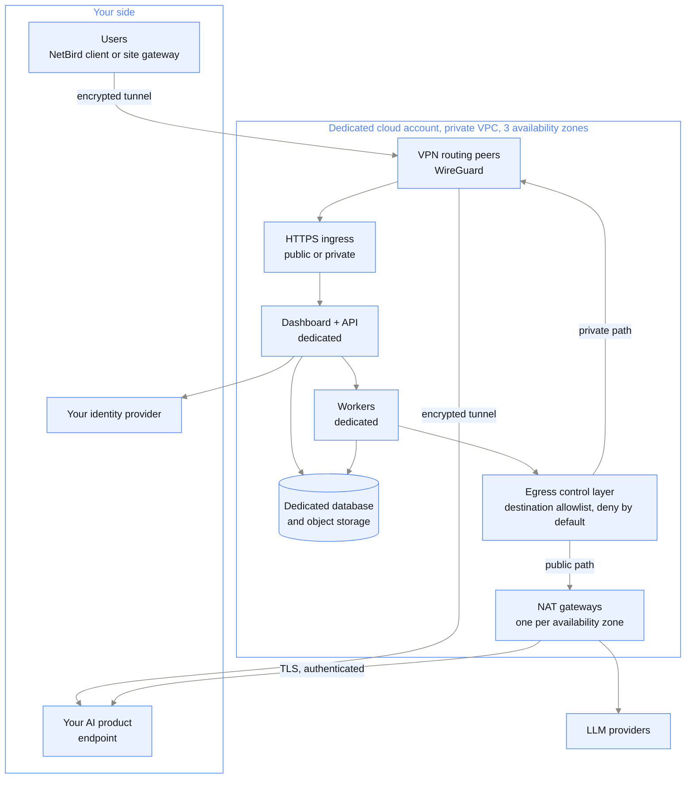

{/* Generated by galtea-docs from Galtea-AI/gitops docs/deployment at deployment-guide-v1.2.0. Do not edit here: change the source page and release the guide. */}

A complete, single-customer copy of the platform, deployed in a **dedicated cloud account**
with its own private network, its own compute, its own database and object storage, and its
own identity provider. Galtea operates it; your team takes on no Kubernetes work.

Nothing is shared with any other customer: not the network, not the compute, not the data
plane. The one exception is operational telemetry: the tenant's metrics, logs and traces go to
Galtea's central observability stack, as
[Observability and operations](/deployment/observability-and-operations) describes.

## What you get

- Dedicated dashboard, API and identity provider, for your organization only.
- Dedicated workers, with capacity sized to you.
- Dedicated database and object storage in a dedicated cloud account.
- A region of your choosing, for data residency.
- **The option of no public exposure at all**: the dashboard and API reachable only through
  an encrypted VPN.
- Your choice of upgrade model: Galtea keeps the tenant continuously up to date, or you pin
  a version and agree each upgrade window.
- Galtea operates, patches, monitors and backs up the tenant.

## Architecture

The VPN carries traffic **in both directions**. Inbound, your users reach the dashboard and
API through it. Outbound, the platform can reach your AI product endpoint through the same
tunnel, so that endpoint never has to be published on the internet.

## Network exposure: two options

**Public with restrictions.** The dashboard and API are on the public internet over HTTPS,
behind a web application firewall, optionally restricted to your source IP ranges. Simplest
to operate and to reach from anywhere.

**Private only.** No public exposure. The dashboard and API are reachable exclusively
through an encrypted VPN built on WireGuard, using NetBird as the overlay network. The
public internet sees no open ports for these services. Two ways for your people to connect:

- **Per-user access**: each user installs the NetBird client (Windows, macOS, Linux, iOS,
  Android) and signs in through your corporate SSO. Their device becomes a peer and reaches
  exactly what their policy allows.
- **Site-to-site**: you run a single routing peer inside your network, which advertises
  the tenant's private ranges to whole offices or data centers. No per-device install, and
  existing systems such as CI runners reach the tenant through normal routing.

Only the routes explicitly advertised are reachable, which means the dashboard and API.
Databases and internal services are not advertised and stay unreachable even for connected
peers. All connections toward the VPN control plane are **outbound from your side over
HTTPS 443**, so no inbound firewall rule is needed on your network.

The VPN control plane is self-hosted inside Galtea's infrastructure and dedicated to
private-tenant connectivity. It coordinates identity, keys and policies only; your
application traffic never passes through it.

When two peers cannot establish a direct path, usually because of strict firewalls or
NAT, the still-encrypted tunnel automatically rides a relay over TLS on port 443. The
relay forwards packets it cannot decrypt, so falling back costs you latency, never
confidentiality. Full detail is in
[Security assurance](/deployment/security-assurance).

## Outbound connectivity to your endpoints

When the platform calls your AI product during a test, the traffic always leaves the tenant
through a dedicated **egress control layer** that enforces an explicit destination allowlist
by hostname: a workload can reach only approved endpoints, and everything else is denied by
default. That layer is also where TLS origination and traffic logging happen.

From there, **you choose one of two paths. Both are fully supported.**

| | Path A: NAT gateway farm | Path B: VPN tunnel |
|---|---|---|
| Route | Egress layer, then a NAT gateway per availability zone, then the internet | Egress layer, then the same encrypted VPN your users come in through |
| Your endpoint needs | A public, TLS-protected URL | Only to be reachable inside your own network |
| Public exposure | Your endpoint is on the internet, optionally IP-restricted to the Galtea egress addresses | None. Neither side is published |
| Source address | Galtea egress IPs, dynamic by default or fixed on request | From inside your own network, so there is nothing to allowlist |
| Choose it when | Your product is already an internet-facing service | Policy says the product must not be reachable from the internet |

Where your own network is on AWS, private-link endpoints or VPC peering achieve the same
result as path B and are offered when your side requires them; the VPN is the option that
works regardless of which cloud or data center you are on. Path B is the reason a private tenant can run with **no internet
path in either direction**: your users reach the platform through the tunnel, and the
platform reaches your product through the tunnel.

### Path A in detail: controlled internet egress

- **High availability**: one NAT gateway per availability zone, across three zones. The
  loss of a zone never severs outbound connectivity, and your allowlisted IPs do not
  change.
- **Egress IPs**: dynamic by default. Fixed egress IPs are available on request, so you can
  allowlist a small, predictable set of source addresses on your side.
- **Authentication**: whatever your endpoint requires. Basic authentication, an API key
  header or a bearer token today. Credentials are held in a managed secret store and
  injected at call time, never hardcoded.
- **Encryption**: HTTPS on every route, with server certificate validation and a minimum
  TLS version enforced at the egress layer. Mutual TLS to your endpoint is on the roadmap and
  not available today.

### Path B in detail: outbound over the VPN

The VPN is not only an inbound option. The same encrypted tunnel that gives your users
private access to the dashboard carries traffic in the outbound direction too, so the
platform can call your AI product through it.

- **Your endpoint stays private.** No public address, no public certificate, no inbound
  internet rule. It only has to be reachable from inside your own network, over a route your
  side advertises into the mesh.
- **Nothing to allowlist on your side**, because the call arrives from inside your network
  rather than from an internet address.
- **Same guarantees as the inbound direction**: WireGuard, encrypted end to end, and only
  the routes explicitly advertised are reachable.
- **The allowlist still applies.** Path B changes the route, not the policy: the egress
  control layer still permits only the destinations you registered.
- **Authentication and TLS still apply** exactly as in path A. A private route is not a
  reason to drop endpoint authentication.

## Where the data lives

In a cloud account dedicated to you, in the region you choose. Today private tenants run
on **AWS**; see [Cloud-specific details](/deployment/cloud-specifics).

## Identity

The tenant has its own identity provider instance. It can be used standalone, or federated
to your corporate IdP over SAML or OIDC, in which case your directory is the source of
truth for who may sign in and with which role, exactly as in
[model 2](/deployment/model-enterprise-organization). Per-organization federation is configured
per tenant.

## LLM inference

Configurable per tenant, and this is one of the main reasons customers pick this model. The
LLM gateway can be pointed at:

- Galtea's provider accounts, the default.
- **Your own provider accounts**: for example your own Azure OpenAI deployment or your own
  Amazon Bedrock access, so inference happens under your contract, in your region and
  against your quota.
- A restricted, approved subset of models, if your compliance framework only allows
  certain ones.

## Upgrades: your choice of two models

Both are supported, and you pick per tenant. You can also start on one and move to the other.

| | Managed by Galtea | Scheduled with you |
|---|---|---|
| How it works | Galtea upgrades the tenant as new versions ship, the same way the shared SaaS is kept current | You pin a version. Galtea proposes an upgrade, you agree a window, Galtea applies and verifies it |
| Downtime | None expected; rolling updates | None expected, inside the agreed window |
| You get new features | As soon as they ship | When you accept the upgrade |
| Effort on your side | None | Reviewing release notes and agreeing a window |
| Choose it when | You want the platform current with no coordination overhead | Your change-management process requires approval before a production change |

Either way Galtea performs the upgrade and owns the rollback. The difference is who decides
when it happens.

## Limits to know

- Provisioning takes days, not minutes: a cloud account, a network design, IdP
  federation and a connectivity plan are involved.
- The VPN option requires your users to install a client, or you to run a routing peer.

## When to choose it

Strict compliance, data-residency or network-control requirements, where you still do not
want to operate Kubernetes. This is the model for customers who need everything a
self-hosted install gives them except the operational burden.
