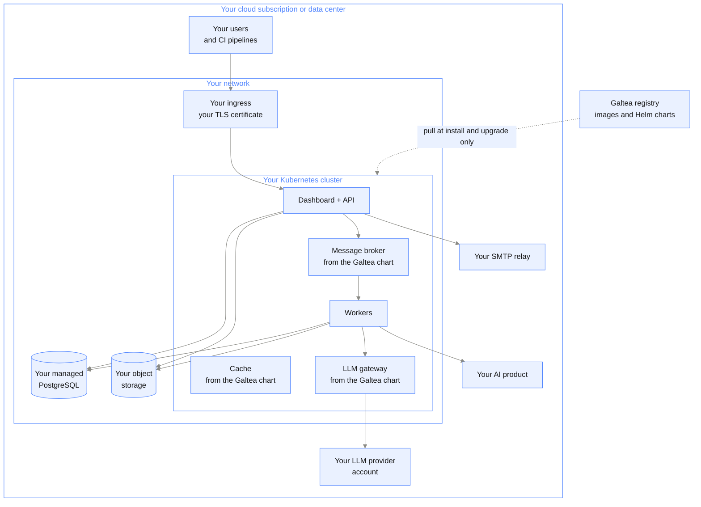

{/* Generated by galtea-docs from Galtea-AI/gitops docs/deployment at deployment-guide-v1.2.0. Do not edit here: change the source page and release the guide. */}

The platform runs inside **your** cloud subscription or data center, on **your** Kubernetes
cluster, against **your** database, storage and LLM provider accounts. Your team operates
it. Galtea ships versioned container images and Helm charts, plus the documentation and
support to run them.

No data and no traffic leaves your perimeter unless you configure it to.

## What you get

- The same product, from the same release line, as a set of Helm charts and container
  images pulled from Galtea's registry.
- A deployment package with values templates, secret templates, a prerequisites checklist
  and per-cloud setup notes.
- A version you pin and upgrade on your own schedule.
- Complete control of the network, the data and the LLM providers.

## What you take on

- Provisioning and operating the Kubernetes cluster, the PostgreSQL database and the
  object storage.
- Certificates, DNS and ingress.
- Backups, restore testing and disaster recovery.
- Monitoring, alerting and first-line incident response.
- Applying upgrades, including database migrations.
- Capacity planning as your evaluation volume grows.

See the [responsibility matrix](/deployment/responsibilities) for the full split.

## Architecture

The only connection from your cluster to Galtea is pulling images and charts from the
registry, and only during an install or an upgrade. The deployment needs no online activation
and no continuous connectivity to Galtea: once installed, it runs with no outbound connection
to Galtea at all. The one exception is opt-in and off by default: you can choose to forward error
events to a Galtea support channel, which is described in
[Observability and operations](/deployment/observability-and-operations).

### The registry: container images and Helm charts

One registry serves both. The **container images** and the **Helm charts** are hosted as OCI
artifacts in **AWS Elastic Container Registry (ECR)**, in `eu-west-1`, at a standard
`<account>.dkr.ecr.eu-west-1.amazonaws.com` endpoint. The credentials Galtea issues you give
access to both, so there is a single registry to allowlist and a single credential to rotate.

- **Reachable over the internet, but not open.** The endpoint is public in the sense that it
  needs no private link to reach, and anonymous pull is not possible. Access is restricted to
  IAM credentials that Galtea issues to you.
- **Read-only credentials.** The permissions needed are only `GetAuthorizationToken`,
  `BatchGetImage`, `GetDownloadUrlForLayer` and `DescribeRepositories`. Nothing can be
  written or deleted with them, and the image-pull actions can be scoped to specific
  repositories on your side if you want them tighter.
- **Short-lived tokens.** ECR authorization tokens last 12 hours. A small `CronJob` shipped
  with the package exchanges your IAM credentials for a token every 2 hours and keeps it in a
  Kubernetes pull secret, so no long-lived Docker credential sits in the cluster.
- **Mirrorable.** If you would rather not have the cluster reach out at all, both the images
  and the charts can be mirrored into your own OCI registry. That is the air-gapped path,
  agreed separately.

### No telemetry to Galtea, and you can check it

This is verifiable in the package you receive, not only a statement on this page:

- Tracing is **off by default**: `OTEL_ENABLED` is `false` and the exporter endpoint is empty
  in the shipped values.
- If you turn tracing on, the exporter points at a collector **inside your own cluster**.
  There is no Galtea endpoint configured to send it to.
- Third-party library telemetry is explicitly opted out where a dependency ships it, for
  example `DEEPEVAL_TELEMETRY_OPT_OUT`.
- Grep the values files for outbound hostnames before you install. The registry endpoint is
  the only Galtea-side address in them.

Usage terms and any reporting of usage are agreed in your contract, not enforced by a callback
from the software.

## Validated target: Azure AKS

The deployment package is validated on **Azure Kubernetes Service** and is fully decoupled
from AWS-specific infrastructure. It requires no cloud load balancer controller, no node
autoscaler and no external secrets operator.

What you provide on Azure. **Managed Azure services are the recommendation; a compatible
self-hosted equivalent is supported for the database and the object store if your policy or
cost model requires it**, with the backup and restore work then falling to your team:

| Component | Notes |
|-----------|-------|
| AKS cluster, 1.28 or later | At least 14 vCPU and 28 GB of allocatable RAM across nodes, for one replica of each service; 15 vCPU and 30 GB if you deploy the task monitor. This is the floor: the charts' declared requests, summed across every release including the broker, the cache and the gateway, total 11.25 vCPU / 22 GiB, and the scheduler also has to fit system pods and the kubelet reserve |
| Azure Database for PostgreSQL, or any PostgreSQL 14+ you run | Two databases: one for the platform, one for the LLM gateway. Allow the cluster node subnet through the firewall. The managed service is recommended; a PostgreSQL you operate yourself is supported. |
| Azure Blob Storage, or any S3-compatible store you run | One container. Note that **file uploads go directly from the user's browser** to the store using a signed URL, so the network your users sit on must be able to resolve and reach it, and CORS must allow a cross-origin `PUT` from your dashboard origin. A self-hosted store such as MinIO works, provided it is reachable from your users' network too. |
| Model provider | The package ships configured for Azure OpenAI out of the box, so the default is Azure OpenAI deployments for the models it routes to. Any provider can be connected through the LiteLLM gateway configuration, and if your approved model set differs from the default, the gateway configuration is adjusted to match. |
| SMTP relay | Azure Communication Services, SendGrid or equivalent |
| Registry credentials | Galtea grants access to the ECR registry that holds both the container images and the Helm charts |

Full step-by-step instructions and the complete checklist ship with the deployment package
Galtea provides, as its `README.md` and `CHECKLIST.md`. The prerequisites are summarized in
[Prerequisites checklist](/deployment/prerequisites-checklist).

## Running without managed services

The default and recommended shape uses your cloud's managed PostgreSQL, object storage and
secret store. Some customers cannot use managed services at all, and that variant is supported:
self-hosted PostgreSQL, an S3-compatible store such as MinIO, and your own secret management,
with the broker, the cache and the search store in-cluster.

It is **agreed explicitly rather than picked from a menu**, because it moves a large amount of
work to you: backups and restore testing, high availability, disaster recovery, patching and
capacity for each of those components, permanently. Expect higher operational cost and more
failure modes than the managed shape, and test the restore before go-live rather than after.

If the reason for avoiding managed services is that the data must not leave your account, note
that managed services in **your own** subscription already satisfy that. This variant is only
necessary when the policy forbids managed services themselves.

## Other clouds

**AWS EKS** is the platform Galtea itself runs on, so the charts are exercised there
continuously; a self-hosted install on your own EKS cluster is a supported path.

**Google GKE, OpenShift and other conformant Kubernetes distributions** are supported as an
adaptation, not as a validated target. The charts hold no hard dependency on a specific
cloud, and every cloud-specific behavior sits behind a value switch. What needs agreeing
per deployment is the equivalent of each managed dependency: object storage, secret
storage, ingress and workload identity. See
[Cloud-specific details](/deployment/cloud-specifics).

## Installation methods

Both are tested and supported, and this matters when your cluster has no GitOps tooling:

- **Plain Helm.** `helm install` and `helm upgrade`, one release at a time. No ArgoCD, no
  KEDA, no cluster autoscaler required. Ordering between components uses Helm hooks, so a
  bare cluster works.
- **ArgoCD**, if you already run GitOps. The charts are the same artifacts.

Detail in [Installation and lifecycle](/deployment/install-and-lifecycle).

## Limits to know

- You are on a pinned version, so you do not get new features until you upgrade.
- Galtea cannot see your environment. Diagnosing an incident requires you to collect and
  share logs and metrics.
- Autoscaling of workers by queue depth is optional and requires KEDA in your cluster.
  Without it, worker capacity is a fixed replica count you set.
- Air-gapped installs, with no path at all to the container registry, need a separate
  agreement: images and charts have to be mirrored into your internal registry.

## How long it takes

Hands-on effort and calendar time differ substantially:

- **Hands-on effort for the first install: roughly 9 to 19 hours**, and most of it is your
  infrastructure preparation rather than the platform. Preparing cluster, database, storage,
  network and egress is 4 to 8 hours; filling values and secrets, 2 to 4; deploying the charts
  and verifying the services, 1 to 3; smoke testing, 2 to 4.
- **Calendar time: weeks**, because that effort sits inside your change process, your approvals
  and any provider quota requests.

Upgrades afterwards are minutes, not hours: a `helm upgrade` on a configured environment needs
no long maintenance window.

## When to choose it

A written policy makes it impossible for the data or the workloads to sit in infrastructure
operated by a third party, even in a dedicated account. **If the constraint is only about where
the data lives, and not about who operates the platform, then
[model 4](/deployment/model-managed-in-your-cluster) meets it with far less work on your side.** If the requirement is dedicated
infrastructure rather than your own perimeter, a
[private tenant](/deployment/model-private-tenant) gives you the same isolation with none of the
operational work.
