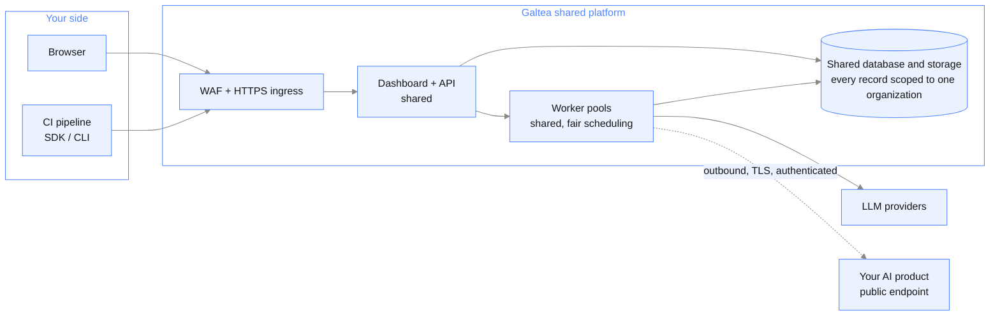

{/* Generated by galtea-docs from Galtea-AI/gitops docs/deployment at deployment-guide-v1.2.0. Do not edit here: change the source page and release the guide. */}

The default way to use Galtea. A fully managed multi-tenant platform. You get an
organization inside it; isolation is logical, enforced per organization.

## What you get

- The dashboard, API, SDK and CLI, on the latest version at all times.
- Shared worker pools that process every organization's jobs with fair scheduling.
- A shared database and object store, where every record is scoped to your organization.
- Access over the public internet, HTTPS only, behind a web application firewall.
- Zero infrastructure and zero operational work on your side.

## Architecture

## How isolation works

Every piece of data belongs to exactly one organization. Every request carries the
caller's identity, and the API resolves the caller's organization and role before any data
is read or written. Cross-organization access is not a permission that can be granted; it
does not exist in the data model.

Role-based access control inside your organization is yours to manage: you invite users
and assign roles, and you can revoke them at any time.

## Where the data lives

In Galtea's cloud account, in `eu-west-1`, the region of the shared platform. If you need a
specific region, that is a private tenant ([model 3](/deployment/model-private-tenant)).

## Access and authentication

- Sign-in with email and password, plus multi-factor authentication.
- API keys for programmatic access from the SDK, the CLI and CI pipelines. Keys are
  scoped to your organization and revocable.
- Corporate single sign-on is available from [model 2](/deployment/model-enterprise-organization)
  onward.

## Connectivity you need to allow

| Direction | From | To | Protocol |
|-----------|------|----|----------|
| Outbound | Your users' browsers and CI runners | The platform dashboard and API | HTTPS 443 |
| Outbound | Your users' browsers | The object storage endpoint, for direct file upload with a signed URL | HTTPS 443 |
| Inbound | The platform workers | Your AI product endpoint, if Galtea calls it during a test | HTTPS 443, authentication of your choice |

If your product endpoint is not reachable from the internet, you have two options: push
results in from your own pipeline using the SDK, so no inbound connection is needed, or
move to a private tenant with a private network path.

## Limits to know

- Capacity is shared, sized with headroom for platform-wide peaks, and jobs are queued and
  retried rather than dropped. What [model 2](/deployment/model-enterprise-organization) adds is
  priority and reserved capacity agreed in contract.
- The version is the current release. You do not pin a version and you do not schedule
  upgrades.
- LLM inference runs through Galtea's provider accounts, in Galtea's region, `eu-west-1`.

## When to choose it

Pilots, evaluations, and any production use where no written policy requires dedicated
infrastructure. It is the fastest path to a first result and the least work to maintain.
