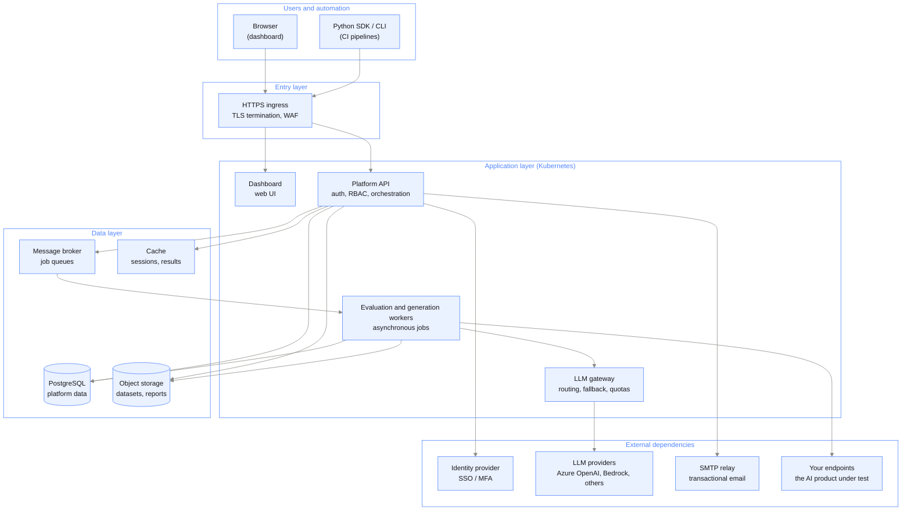

{/* Generated by galtea-docs from Galtea-AI/gitops docs/deployment at deployment-guide-v1.2.0. Do not edit here: change the source page and release the guide. */}

One architecture serves all five deployment models. What changes between models is where
it runs and who operates it, not what it is made of.

The platform is a set of containerized services on Kubernetes, plus four managed
dependencies: a PostgreSQL database, an object store, a message broker and a cache.

## Logical view

## Components

### Application layer

| Component | What it does | Required |
|-----------|--------------|----------|
| Dashboard | The web interface: products, test suites, evaluations, results, reports. | Yes |
| Platform API | The single entry point for the dashboard, the SDK and the CLI. Owns authentication, organizations, role-based access control, billing and job orchestration. | Yes |
| Evaluation and generation workers | The compute-heavy part. Runs LLM-as-a-judge evaluations, synthetic dataset generation, adversarial (red-teaming) test generation, conversation simulation and report generation, as asynchronous jobs. | Yes |
| LLM gateway | One outbound choke point for every model call: routing between providers, fallback, retries and quota control. Lets you swap or restrict models without touching the services. | Yes |

The workers are several independent services, one per capability, so capacity can be
sized per workload. In the shared models this is invisible to you. In a self-hosted
install they are deployed as two Helm releases: one for the request-serving services and
one for the asynchronous workers.

### Data layer

| Dependency | Purpose | Recommended | Self-hosted alternative |
|------------|---------|-------------|-------------------------|
| PostgreSQL 14 or later, **17 recommended** | All platform data: organizations, users, products, tests, evaluation results. Two logical databases are used, one for the platform and one for the LLM gateway. Galtea's own production runs PostgreSQL 17. | The provider's managed service: Amazon RDS, Azure Database for PostgreSQL, Cloud SQL | Any PostgreSQL 14+ you run yourself, in the cluster or on a VM |
| Object storage | Uploaded datasets, generated files, PDF reports. | Amazon S3, Azure Blob Storage, Google Cloud Storage | Any S3-compatible store you run yourself, for example MinIO or Ceph |
| Message broker | Job queues between the API and the workers. | RabbitMQ in-cluster from the Galtea chart, which is the default | A managed AMQP service, or your own RabbitMQ |
| Cache | Sessions, intermediate results, rate limiting. | Redis in-cluster from the Galtea chart, which is the default | A managed Redis service, such as ElastiCache or Azure Cache for Redis |

**Every stateful dependency can run self-hosted with a compatible component, and Galtea
recommends the cloud provider's managed service wherever one exists.** The platform does not
care which you choose: it speaks standard PostgreSQL, the S3 API, AMQP and the Redis
protocol, so a compatible self-hosted component works and is supported.

The recommendation is about who carries the operational risk. With a managed service, backups
and point-in-time recovery, patching, failover and storage growth are the provider's problem.
Self-hosted, they are yours, and in practice a self-run database or object store is the most
common source of data-loss and downtime incidents in a customer-operated install. If your
policy or your cost model requires self-hosting, do it, but plan the backup and restore
testing explicitly.

**Note on the broker and the cache.** These two are the exception to the recommendation: the
Galtea charts deploy RabbitMQ and Redis in-cluster by default, and that is the tested path. They hold
queues and transient state, not your data, so losing them costs queued jobs that can be re-run
rather than records. Pointing them at a managed equivalent is supported if you prefer it.

Object storage carries one requirement that is easy to miss: browser uploads go **directly**
from the user's browser to the store using a short-lived signed URL, so the network your users
sit on must be able to reach that endpoint. This applies to a managed service and a
self-hosted one alike.

### External dependencies

| Dependency | Purpose | Required |
|------------|---------|----------|
| Identity provider | Sign-in and MFA. Built into the platform by default; from model 2 onward it can be your corporate IdP over SAML or OIDC. | Built-in by default |
| LLM providers | The models that run evaluations and generate data. Reached only through the LLM gateway. | Yes |
| SMTP relay | Transactional email: invitations, notifications, password resets. | Yes |
| Your product endpoints | The AI system being tested. Reached outbound from the workers. Optional: you can also push results in from your own pipeline using the SDK. | Optional |

## Kubernetes requirements (self-hosted and private tenant)

| Requirement | Minimum | Notes |
|-------------|---------|-------|
| Kubernetes | 1.28 | Any conformant distribution. This is the floor the charts require; Galtea runs and tests on 1.34. Pick a version still in upstream support rather than the floor. |
| Helm | 3.12 | OCI registry support is required to pull the Galtea charts |
| Cluster capacity | 14 vCPU / 28 GB allocatable RAM, 15 vCPU / 30 GB with the task monitor | Across nodes, for a functional install of all services at one replica each. This is the floor: the sum of the declared resource requests across every release in the install order, including the broker, the cache and the gateway, is 11.25 vCPU / 22 GiB, plus node overhead for system pods and the kubelet reserve. Real sizing depends on evaluation volume and is agreed per deployment. |
| Storage class | Dynamic provisioning, `ReadWriteOnce` | For the broker and cache volumes |
| Ingress | Any ingress controller, or a cloud load balancer | TLS certificate provided by you |
| Outbound network | HTTPS to the container registry, the LLM providers, the SMTP relay and your product endpoints | Destinations can be restricted to an explicit allowlist |

Optional components, off by default, each behind a single switch:

- Horizontal autoscaling driven by queue depth
- Node autoscaling
- Automatic pod restart on secret change
- A service mesh for in-cluster mutual TLS

None of them is required for a working install.
See [Installation and lifecycle](/deployment/install-and-lifecycle).

### Recommended for anything you run yourself

Not required to install, and strongly recommended before you put real load through the
platform, because without them a failed asynchronous job is invisible until someone notices a
missing result:

| Component | Why |
|-----------|-----|
| Celery task monitor | Task failure detection, queue and worker health, alerting on stuck work. This is the difference between knowing a batch failed and finding out from a user. |
| Search and analytics store | The task monitor's storage dependency: it keeps task execution and operational metadata. Managed or in-cluster, either works. |
| Metrics, logs and traces | Any standard stack. The services emit Prometheus metrics and OpenTelemetry traces, so nothing proprietary is needed. |

Galtea's own environments run all three, and a Galtea-operated deployment includes them. In a
self-hosted install they are yours to deploy, and skipping them is the single most common reason
an incident takes hours instead of minutes. Budget cluster capacity for them: the search store
in particular is not small.

## What is deliberately not in the picture

- **No agent inside your network**, in any model where the platform is reachable over
  HTTPS. Automation talks to the API using the SDK or the CLI. The exception is a private
  tenant with private-only access, where reaching the platform means running a NetBird
  client, a routing peer or the operator on your side.
- **No inbound connection from Galtea into your network** for the platform to function.
  Traffic toward your product endpoints is outbound from the platform, with you as the
  server. In model 4 you issue Galtea scoped, revocable credentials to your cluster, which
  is the one case where access runs in that direction, by design and under your control.
- **No model training on your data by Galtea.** Your data is used to run the tests you
  define. Because inference runs through LLM providers, what governs training on submitted
  data is the terms of the provider account in use: Galtea's enterprise terms in shared
  SaaS, your own account and terms in a private tenant or self-hosted install.
