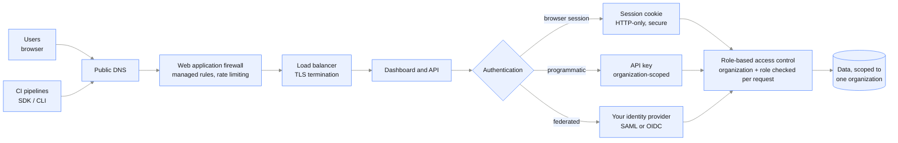
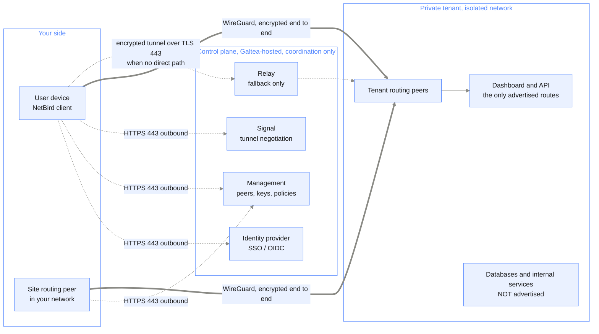

{/* Generated by galtea-docs from Galtea-AI/gitops docs/deployment at deployment-guide-v1.2.0. Do not edit here: change the source page and release the guide. */}

This is the page for your security reviewers and decision makers. It answers "should we run
this, and can we trust it": what enters, what leaves and under what policy, what is isolated
from what, who can authenticate, how data is protected, what the platform sends home, and how
Galtea support access works. The companion page,
[Connectivity implementation](/deployment/connectivity-implementation), is
the "how do I set it up" side: certificates, allowlists, endpoint registration and CORS. The exact list of outbound
destinations, host by host, is in
[Outbound connectivity reference](/deployment/connectivity-reference).

Depth note: this page describes mechanisms, protocols and destination categories. The exact
internal topology and addresses of a Galtea-operated deployment are shared under NDA during a
security review. The components you install yourself are listed in
[Installation examples](/deployment/installation-examples).

## 1. Inbound: how users reach the platform

Controls on this path:

| Control | Detail |
|---------|--------|
| Transport | HTTPS only. HTTP is redirected. Modern TLS versions only. |
| Web application firewall | Managed rule sets against common web attacks, plus rate limiting. |
| Source restriction | Optional. Access can be limited to your IP ranges, in a private tenant. |
| Authentication | Session cookie for browsers, organization-scoped API keys for automation, or federation to your identity provider. |
| Multi-factor authentication | Available in every model. In federated mode your own MFA policy applies. |
| Authorization | Every request resolves the caller's organization and role before any data access. |
| No public admin surface | Databases, brokers, caches and internal endpoints are never published to the internet in any model. |
| No exposed infrastructure addresses | In Galtea-operated deployments, public entry is fronted so that no cluster or node address is reachable from the internet. What resolves publicly is the entry layer, never infrastructure. |

In a **private tenant with private-only access** there is no public entry at all: this whole
path sits behind the VPN, and the public internet sees no open ports for the dashboard or
API. See *Private network access (private tenant)* below.

## 2. Outbound: the egress policy

The stance is **deny by default**. All outbound traffic is forced through an egress control
layer that enforces an explicit allowlist by hostname: a workload cannot reach an endpoint
that is not on the list. That layer is a **single choke point**, where outbound policy, TLS
origination and traffic logging apply. The complete list of destinations, with hostnames,
ports and when each fires, is in
[Outbound connectivity reference](/deployment/connectivity-reference); the mechanics of setting the
routes up, including the choice between internet egress and the VPN tunnel, are in
[Connectivity implementation](/deployment/connectivity-implementation).

What leaves, by category, and whether you can restrict it:

| Destination category | Why | Can it be restricted? |
|----------------------|-----|-----------------------|
| LLM providers | Running evaluations and generating data | Yes. In a private tenant or self-hosted install you can point the gateway at your own provider accounts, or restrict it to an approved model subset. |
| Your AI product endpoint | Calling the system under test | Yes, three ways. Only endpoints you register are allowlisted; the call can be routed through the VPN tunnel instead, so it never touches the internet; or you avoid the outbound call entirely by pushing results in from your own pipeline with the SDK. |
| SMTP relay | Transactional email | Yes. Your own relay in a private tenant or self-hosted install. |
| Container and chart registry | Pulling images at install and upgrade | Yes. Mirroring into your internal registry is possible for air-gapped installs. |
| Slack webhook, optional | Forwarding error events to a support channel, if you enable it | Yes. Off by default; you can point it at your own channel instead, or leave it disabled. Error events only, never test data or model outputs. |

One more property that matters for trust: **resilience**. Outbound calls carry timeouts,
retries with backoff and circuit breaking, so a slow or failing endpoint of yours cannot
degrade the platform.

Capabilities that can be layered on the egress path, depending on your security and
compliance requirements:

| Add-on | What it gives you |
|--------|-------------------|
| Mutual TLS | **On the roadmap, not available today.** It would let your side cryptographically verify the platform as the caller, beyond IP allowlisting. Ask for the current status rather than planning around it |
| Per-destination observability | Request counts, latency, error rates and TLS failures per endpoint, for joint troubleshooting |
| Outbound rate and payload limits | Caps that protect your endpoint and keep the platform inside your quotas |
| Secret rotation | Your credentials held with rotation support and least-privilege access |
| Audit trail | An immutable log of who configured each destination, allowlist entry and credential |
| Stated egress region | The region the tenant egresses from, so you can reason about residency and latency |

## 3. Isolation inside the platform

| Layer | Shared SaaS | Private tenant | Self-hosted |
|-------|-------------|----------------|-------------|
| Cloud account | Galtea's, shared | Dedicated per customer | Yours |
| Network | Shared private network, no public data-layer exposure | Dedicated private network, three availability zones | Yours |
| Kubernetes namespaces | Separate namespaces per function, with network policies between them | Same | Same |
| Compute | Shared worker pools (model 1) or pools reserved for your organization (model 2) | Dedicated | Yours |
| Database | Shared instance, every record scoped to one organization | Dedicated instance | Yours |
| Object storage | Shared bucket, per-organization prefixes and scoped signed URLs | Dedicated | Yours |
| In-cluster encryption | **Mutual TLS between services, in place**: a service mesh encrypts east-west traffic, so no service-to-service call is in clear text inside the cluster | Same, in place | Optional, via a service mesh you enable |

*Model 4 reads as the self-hosted column for infrastructure and the private-tenant column for
the platform: the cluster, network and compute are yours, while the isolation the platform
itself enforces is what Galtea runs in a private tenant.*

**On logical isolation in the shared models.** Cross-organization data access is not a
permission that exists and then gets denied; it is absent from the data model. Every query
is bound to the caller's organization by the API before it reaches the database. Signed URLs
for object storage are minted per request, short-lived and scoped to a single object.

## 4. Private network access (private tenant)

A private tenant can be configured with **no public exposure at all**. The dashboard and API
are then reachable only through an encrypted VPN built on WireGuard, using NetBird as the
overlay network.

Properties that answer the usual security questions:

- **No inbound firewall rule on your side.** Every connection to the control plane is
  outbound from your peer over standard HTTPS 443. This works through strict corporate
  firewalls.
- **The control plane never sees your traffic.** It coordinates identity, keys and access
  policies. Application traffic flows peer to peer over WireGuard.
- **The relay cannot read anything.** When no direct peer-to-peer path exists, the still
  encrypted tunnel rides a relay, which forwards packets it cannot decrypt.
- **Identity-based access.** Every peer authenticates against the identity provider before
  joining. Access policies are expressed over groups of peers, for example "analysts may
  reach the dashboard and API, and nothing else". Removing a user in your directory removes
  their VPN access.
- **Only advertised routes are reachable.** Databases and internal services are not
  advertised and stay unreachable even for a connected peer.
- **The tunnel works in both directions.** Inbound, your users reach the dashboard and API.
  Outbound, the platform reaches your AI product endpoint through the same mesh, using a
  route your side advertises. A fully private setup therefore keeps *both* directions off
  the public internet: nothing about the platform is published, and nothing about your
  product has to be.
- **Self-hosted control plane.** The VPN control plane runs inside Galtea's own
  infrastructure and is dedicated to private-tenant connectivity. It is not a third-party
  SaaS holding your network metadata.

Alternatives to the VPN, per tenant: cloud private-link endpoints or network peering
between your network and the tenant. Setting any of this up is
[Connecting to the Galtea VPN](/deployment/connecting-to-the-galtea-vpn), and the
choice between the VPN and a public endpoint with an egress allowlist is discussed in
[Connectivity implementation](/deployment/connectivity-implementation).

## 5. Identity and access control

| Mechanism | Where it applies |
|-----------|------------------|
| Built-in identity provider with MFA | Every model, the default |
| Federation to your IdP over SAML or OIDC | Model 2 onward |
| Group-to-role mapping | Federated mode: your directory decides the user's role, re-evaluated at sign-in |
| Deny on absence | A federated user with no mapped group has no access. There is no local-password fallback for federated users. |
| Organization-scoped API keys | Every model. Revocable individually. |
| Role-based access control | Every model, enforced per request inside the API |

## 6. Data protection

| Property | Detail |
|----------|--------|
| Encryption in transit | TLS on every external path. Mutual TLS between internal services, available. |
| Encryption at rest | Database, object storage and volumes are encrypted. A private tenant gets its **own keys, created when the tenant is deployed**, so no key is shared with another customer. Customer-managed keys are available as a **provisioning-time option**: ask for them before the tenant is built, because the key of a database or a volume cannot be changed afterwards without a snapshot-and-restore migration. See below. |
| Secrets | Held in a managed secret store, injected at runtime. Never in an image, never in a chart, never in a values file committed to git. |
| Data residency | `eu-west-1` for shared SaaS; the region you choose for a private tenant; your infrastructure when self-hosted. |
| Residency of the inference itself | Handled explicitly, because a regional platform calling a global model endpoint would break residency. EU processing is served by EU data-zone deployments and region-pinned inference profiles, exposed as separate model entries with their own credentials. Endpoints that do not guarantee a processing location are **not used for enterprise tenants**. European models and self-hosted open-weight models are both available: see [Cloud-specific details](/deployment/cloud-specifics). |
| Failover versus residency | Multi-provider failover protects availability and can move a request to another provider. Restricting the allowed set to EU-pinned entries removes that fallback. Both are supported; they trade against each other, so the choice is made per deployment rather than assumed. |
| Retention | Configurable per deployment for results and generated artifacts. Deletion on request. |
| Training | Galtea does not train models on your data, and in shared SaaS and private tenants **the LLM providers do not use your data for training either**: the enterprise provider terms those deployments run under exclude it. In a private tenant or self-hosted install you can additionally bring your own provider account and terms, and restrict which providers are reachable at all. |
| Data classification | The platform holds your test definitions, the prompts and inputs you supply, the responses your product returns, and evaluation results. Treat it as holding whatever your test data holds, and scope your test data accordingly. |

### Customer-managed keys, if you need them

A private tenant already gets keys of its own. Going further, so that **you** control the key
material, is supported for the services that offer it, with two things to decide up front.

**Decide it before the tenant is built.** The encryption key of a managed database or a disk
volume is fixed when that resource is created. Adding customer-managed keys to a tenant that is
already running is a snapshot-and-restore migration with downtime, not a setting Galtea flips. Raised
during provisioning, it is configuration.

**Decide whose account holds the key.** Two very different arrangements:

| | Dedicated key in the tenant account | Key in your own account |
|---|---|---|
| Who holds the key material | Galtea, in your dedicated account, one key per tenant | You |
| You can revoke access unilaterally | No | **Yes**, which is usually the point |
| Availability impact | None | Disabling the key stops the tenant. A managed database whose key becomes unreachable needs a recovery procedure, not a restart |
| What it needs | Nothing extra | Cross-account key policy and grants for each service, and a contract clause on who owns an outage caused by revocation and what the recovery time is |

The second one is what a strict "hold your own key" requirement means, and it is offered, but
the availability coupling is real and belongs in the contract rather than in a diagram.

Two behaviors run counter to what people expect. Rotating a key **does not re-encrypt data
already written**, it applies to new writes. Backups inherit the key of the resource they came
from, so a restore needs that key to be reachable, including in a different account for disaster
recovery.

## 7. What the software sends home

Two channels get asked about in every review, and both have a short answer.

**Telemetry: none.** A self-hosted install runs with no outbound connection to Galtea at all
once installed. Tracing is off by default and, if you enable it, points at a collector inside
your own cluster; third-party library telemetry is explicitly opted out. **This is verifiable
in the package you receive, not only a statement on this page**: grep the values files for
outbound hostnames before you install, and the registry endpoint is the only Galtea-side
address in them. The full claim, item by item, is in
[Model 5: Self-hosted](/deployment/model-self-hosted).

**Error forwarding: opt-in and off by default.** You can choose to forward application-level
and evaluation-level error events to a Galtea support Slack channel. What is sent: service
name, error type and message, and correlation identifiers. What is never sent: your test data,
prompts, model outputs and evaluation results. The channel carries failure signals, not
payloads, and turning it off is removing the webhook URL from your values. Detail in
[Observability and operations](/deployment/observability-and-operations).

## 8. Galtea support access

This is the question every security review asks. The controls behind these answers,
including how access is granted, reviewed and revoked, are published in the trust center linked
in *Certifications, policies and subprocessors* below.

| Model | Can Galtea reach your data? |
|-------|-----------------------------|
| Shared SaaS | Yes. A restricted set of Galtea personnel can access the production platform for operations and support, under access control and audit logging. |
| Private tenant | Yes. Galtea operates the tenant, so operational access exists, restricted to named personnel, authenticated through Galtea's identity provider with MFA, and logged. Break-glass procedures and further restrictions can be agreed per contract. |
| Self-hosted | No. Galtea has no access to your environment and no runtime connection to it. Diagnosing an incident requires you to share logs and metrics. |

*Model 4 reads as the self-hosted column: the cluster is yours, and Galtea's access is limited
to the scoped, revocable credentials you issue for the platform operation described in
[model 4](/deployment/model-managed-in-your-cluster).*

**Audit logs exist**, covering administrative actions and access to production systems. They
are an internal control: the Galtea security and platform teams use them for review and
investigation, and they are **not exposed to customers**, in any deployment model. So treat
them as evidence that access is accountable, not as a feed you can query. If your compliance
framework requires customer-visible audit records, raise it early and Galtea scopes it with you as
part of the deployment. The access-control and logging policies behind this are in the trust center, linked in
*Certifications, policies and subprocessors* below.

## 9. Reporting a vulnerability

Report suspected vulnerabilities to your Galtea contact or to the security address in your
contract.

Penetration testing is part of Galtea's annual security audit cycle, which runs under the
ISO 27001 programme. Testing that you want to run
yourself is possible but must be scheduled with Galtea first: do not test against the shared SaaS
platform without written authorization, since it is multi-tenant and your traffic is
indistinguishable from an attack on other customers. Against a private tenant or your own
self-hosted install there is no such constraint beyond agreeing a window.

## 10. Certifications, policies and subprocessors

**Galtea is ISO 27001 certified.** The certificate, its scope, the full policy set and the
subprocessor list are published and kept current in the trust center,
**[https://trust.galtea.ai](https://trust.galtea.ai)**, without an NDA.

Beyond naming the certification, these pages do not copy the trust center: a certification
status, an audit date or a control description reproduced into a document goes stale the moment
it changes, and the customer is then holding a file that contradicts the live source. So for
certification scope, control descriptions, data-processing terms and subprocessors, use the
trust center; for how the platform is deployed and what crosses which boundary, use these pages.

Where a section here touches a policy, it names the policy to look for there rather than
restating it. The ones these pages lean on:

| Topic on this page | Policy to read in the trust center |
|---------------------|------------------------------------|
| Galtea support access | Access control, and logging and monitoring |
| Penetration testing | Vulnerability management, and the audit programme |
| Encryption and key handling | Cryptography, and data classification |
| Data retention and deletion | Data retention, and data deletion |
| Subprocessors used for inference | Subprocessor list, and third-party risk |

If you need a signed data-processing agreement, or a report under NDA, ask your Galtea contact
rather than inferring the answer from these pages.
